# 🎯 Service Booking API - 服務預約管理系統

<div align="center">


一個基於 **TypeScript + Node.js + Koa + SQLite** 的現代化服務預約管理後端 API 系統

[快速開始](#-快速開始) • [系統架構](#-系統架構) • [API 文檔](#-api-文檔) • [開發指南](#-開發指南) • [部署](#-部署)

</div>

---

## 📖 目錄

- [專案簡介](#-專案簡介)
- [快速開始](#-快速開始)
- [系統架構](#-系統架構)
- [API 文檔](#-api-文檔)
- [開發指南](#-開發指南)
- [測試策略](#-測試策略)
- [CI/CD 流程](#-cicd-流程)
- [Docker 容器化](#-docker-容器化)
- [監控與維運](#-監控與維運)
- [學習路線圖](#-學習路線圖)
- [常見問題](#-常見問題)
- [貢獻指南](#-貢獻指南)

---

## 🌟 專案簡介

### 核心功能

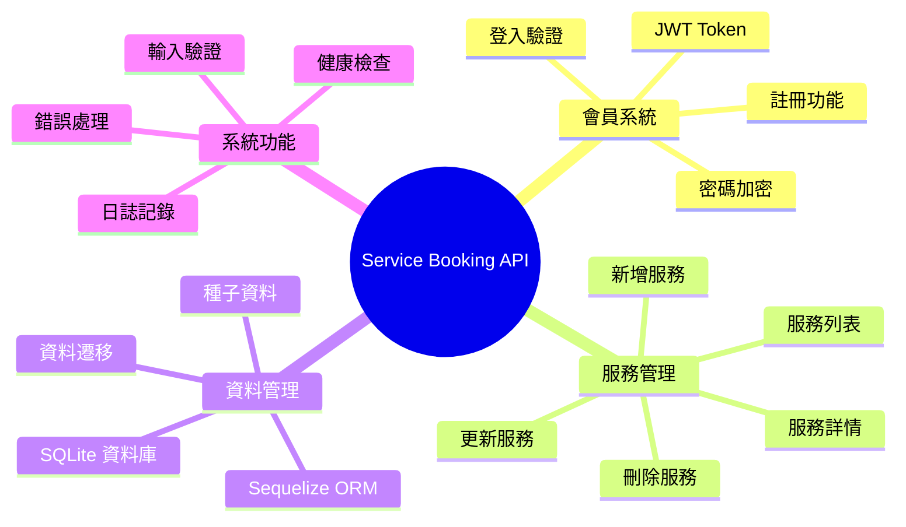
```mermaid
mindmap
  root((Service Booking API))
    會員系統
      註冊功能
      登入驗證
      JWT Token
      密碼加密
    服務管理
      服務列表
      服務詳情
      新增服務
      更新服務
      刪除服務
    資料管理
      SQLite 資料庫
      Sequelize ORM
      資料遷移
      種子資料
    系統功能
      輸入驗證
      錯誤處理
      日誌記錄
      健康檢查
```

### 技術特色

- 🎯 **TypeScript** - 完整的型別安全保護
- 🚀 **Koa 框架** - 輕量且高效的 Web 框架
- 🗄️ **SQLite** - 輕量級嵌入式資料庫
- 🔐 **JWT 認證** - 安全的身份驗證機制
- ✅ **Joi 驗證** - 強大的資料驗證
- 🧪 **完整測試** - 單元測試與整合測試
- 📝 **ESLint + Prettier** - 統一的程式碼風格
- 🐳 **Docker 支援** - 容器化部署
- 📊 **Jaeger 追蹤** - 分散式追蹤系統

---

## 🚀 快速開始

### 環境需求

- Node.js >= 20.10.0
- npm >= 10.0.0
- Git

### 快速安裝流程


```mermaid
flowchart LR
    Start([開始]) --> Clone[克隆專案]
    Clone --> Install[安裝依賴]
    Install --> Config[設定環境]
    Config --> DB[初始化資料庫]
    DB --> Run[啟動服務]
    Run --> Success([成功運行!])

    style Start fill:#e1f5e1
    style Success fill:#e1f5e1
```

### 詳細步驟

#### 1️⃣ 克隆專案

```bash
git clone https://github.com/yourusername/service-booking-api.git
cd service-booking-api
```

#### 2️⃣ 安裝 Node.js 版本

```bash
# 使用 nvm 管理 Node.js 版本（推薦）
nvm install
nvm use

# 或者手動安裝 Node.js 20.10.0+
```

#### 3️⃣ 安裝依賴套件

```bash
npm install
```

#### 4️⃣ 環境設定

```bash
# 複製環境變數範本
cp .env.example .env

# 編輯 .env 檔案
```

必要的環境變數：

```env
# 應用程式設定
NODE_ENV=development
PORT=3000

# 資料庫設定
DATABASE_URL=sqlite:./database.sqlite

# JWT 設定
JWT_SECRET=your-super-secret-key-change-this
JWT_EXPIRES_IN=24h

# 密碼加密設定
BCRYPT_ROUNDS=12
```

#### 5️⃣ 初始化資料庫

```bash
# 執行資料庫遷移
npm run migrate

# 載入測試資料（可選）
npm run seed
```

#### 6️⃣ 啟動服務

```bash
# 開發模式（熱重載）
npm run dev

# 生產模式
npm run build
npm start
```

🎉 **恭喜！** 服務現在運行在 http://localhost:3000

---

## 🏗️ 系統架構

### 整體架構圖

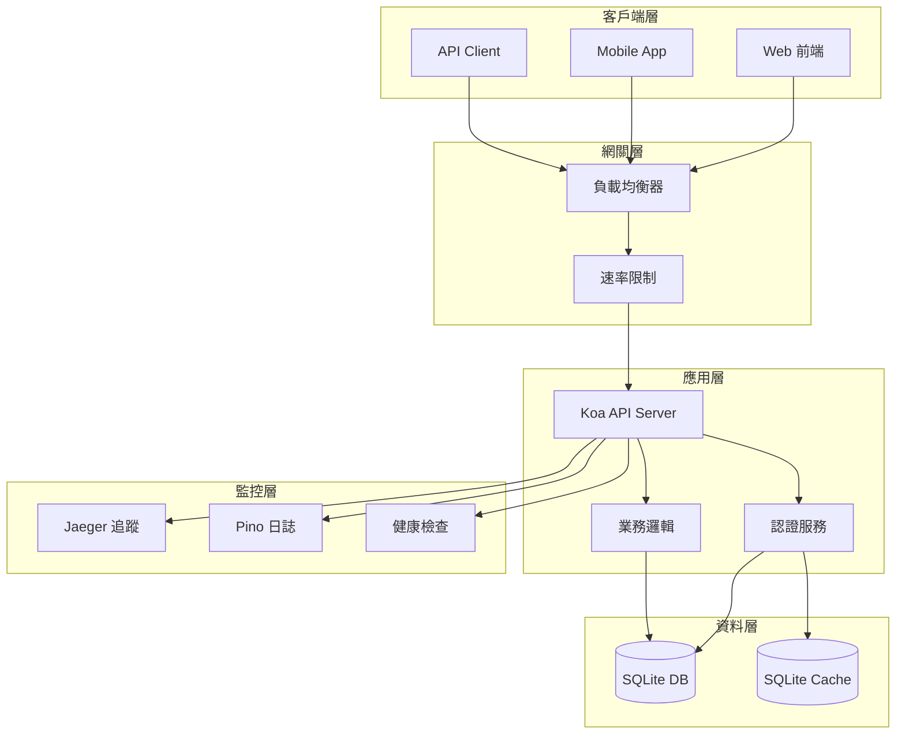
```mermaid
flowchart TB
    subgraph "客戶端層"
        Web["Web 前端"]
        Mobile["Mobile App"]
        API_Client["API Client"]
    end

    subgraph "網關層"
        LB["負載均衡器"]
        RateLimit["速率限制"]
    end

    subgraph "應用層"
        API["Koa API Server"]
        Auth["認證服務"]
        BizLogic["業務邏輯"]
    end

    subgraph "資料層"
        SQLite[(SQLite DB)]
        Cache[(SQLite Cache)]
    end

    subgraph "監控層"
        Jaeger["Jaeger 追蹤"]
        Logs["Pino 日誌"]
        Health["健康檢查"]
    end

    Web --> LB
    Mobile --> LB
    API_Client --> LB

    LB --> RateLimit
    RateLimit --> API

    API --> Auth
    API --> BizLogic

    Auth --> SQLite
    BizLogic --> SQLite
    Auth --> Cache

    API --> Jaeger
    API --> Logs
    API --> Health
```

### 分層架構設計

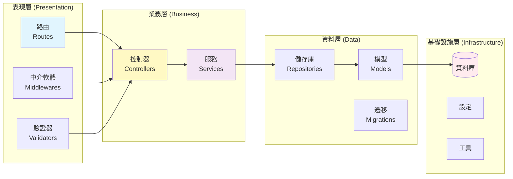
```mermaid
flowchart LR
    subgraph "表現層 (Presentation)"
        Routes["路由<br/>Routes"]
        Middlewares["中介軟體<br/>Middlewares"]
        Validators["驗證器<br/>Validators"]
    end

    subgraph "業務層 (Business)"
        Controllers["控制器<br/>Controllers"]
        Services["服務<br/>Services"]
    end

    subgraph "資料層 (Data)"
        Repositories["儲存庫<br/>Repositories"]
        Models["模型<br/>Models"]
        Migrations["遷移<br/>Migrations"]
    end

    subgraph "基礎設施層 (Infrastructure)"
        Database[(資料庫)]
        Config["設定"]
        Utils["工具"]
    end

    Routes --> Controllers
    Middlewares --> Controllers
    Validators --> Controllers
    Controllers --> Services
    Services --> Repositories
    Repositories --> Models
    Models --> Database

    style Routes fill:#e1f5fe
    style Controllers fill:#fff9c4
    style Services fill:#f3e5f5
    style Database fill:#ffebee
```

### 資料庫架構 (ER Diagram)

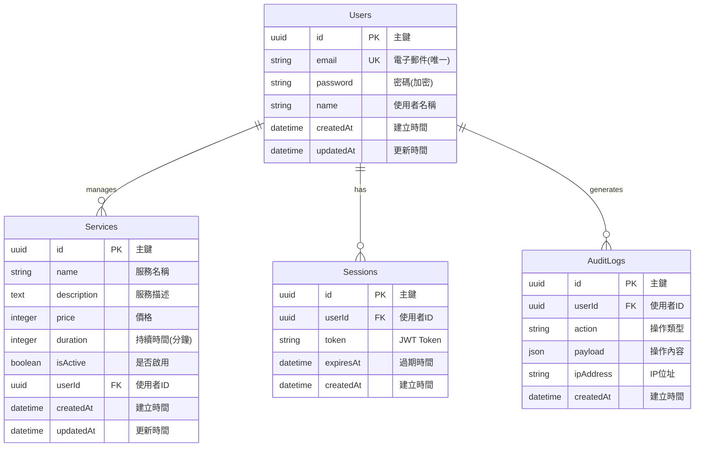
```mermaid
erDiagram
    Users ||--o{ Services : manages
    Users ||--o{ Sessions : has
    Users ||--o{ AuditLogs : generates

    Users {
        uuid id PK "主鍵"
        string email UK "電子郵件(唯一)"
        string password "密碼(加密)"
        string name "使用者名稱"
        datetime createdAt "建立時間"
        datetime updatedAt "更新時間"
    }

    Services {
        uuid id PK "主鍵"
        string name "服務名稱"
        text description "服務描述"
        integer price "價格"
        integer duration "持續時間(分鐘)"
        boolean isActive "是否啟用"
        uuid userId FK "使用者ID"
        datetime createdAt "建立時間"
        datetime updatedAt "更新時間"
    }

    Sessions {
        uuid id PK "主鍵"
        uuid userId FK "使用者ID"
        string token "JWT Token"
        datetime expiresAt "過期時間"
        datetime createdAt "建立時間"
    }

    AuditLogs {
        uuid id PK "主鍵"
        uuid userId FK "使用者ID"
        string action "操作類型"
        json payload "操作內容"
        string ipAddress "IP位址"
        datetime createdAt "建立時間"
    }
```

### 專案結構

```
service-booking-api/
├── 📁 src/                    # 原始碼目錄
│   ├── 📁 config/            # 設定檔案
│   │   ├── database.ts       # 資料庫設定
│   │   ├── app.ts           # 應用程式設定
│   │   └── jwt.ts           # JWT 設定
│   ├── 📁 controllers/       # 控制器層
│   │   ├── auth.controller.ts
│   │   └── service.controller.ts
│   ├── 📁 services/          # 服務層（業務邏輯）
│   │   ├── auth.service.ts
│   │   └── service.service.ts
│   ├── 📁 repositories/      # 資料存取層
│   │   ├── user.repository.ts
│   │   └── service.repository.ts
│   ├── 📁 models/            # 資料模型
│   │   ├── user.model.ts
│   │   └── service.model.ts
│   ├── 📁 middlewares/       # 中介軟體
│   │   ├── auth.middleware.ts
│   │   ├── error.middleware.ts
│   │   └── validation.middleware.ts
│   ├── 📁 routes/            # 路由定義
│   │   ├── auth.routes.ts
│   │   ├── service.routes.ts
│   │   └── index.ts
│   ├── 📁 utils/             # 工具函數
│   │   ├── logger.ts
│   │   └── validator.ts
│   ├── 📁 database/          # 資料庫相關
│   │   ├── migrations/      # 資料庫遷移
│   │   └── seeds/           # 種子資料
│   ├── 📁 types/             # TypeScript 型別定義
│   └── 📄 index.ts           # 應用程式入口
├── 📁 tests/                  # 測試檔案
├── 📁 dist/                   # 編譯輸出
├── 📄 .env.example           # 環境變數範本
├── 📄 .eslintrc.js           # ESLint 設定
├── 📄 .prettierrc            # Prettier 設定
├── 📄 jest.config.js         # Jest 設定
├── 📄 tsconfig.json          # TypeScript 設定
├── 📄 package.json           # 專案設定
└── 📄 README.md             # 專案說明
```

---

## 📡 API 文檔

### API 端點總覽

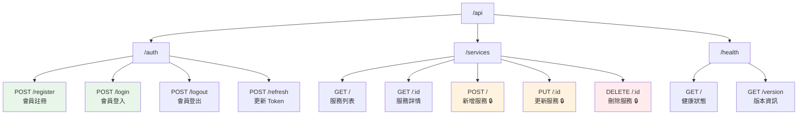
```mermaid
flowchart TD
    API["/api"]

    API --> Auth["/auth"]
    API --> Services["/services"]
    API --> Health["/health"]

    Auth --> Register["POST /register<br/>會員註冊"]
    Auth --> Login["POST /login<br/>會員登入"]
    Auth --> Logout["POST /logout<br/>會員登出"]
    Auth --> Refresh["POST /refresh<br/>更新 Token"]

    Services --> List["GET /<br/>服務列表"]
    Services --> Detail["GET /:id<br/>服務詳情"]
    Services --> Create["POST /<br/>新增服務 🔒"]
    Services --> Update["PUT /:id<br/>更新服務 🔒"]
    Services --> Delete["DELETE /:id<br/>刪除服務 🔒"]

    Health --> Status["GET /<br/>健康狀態"]
    Health --> Version["GET /version<br/>版本資訊"]

    style Register fill:#e8f5e9
    style Login fill:#e8f5e9
    style Create fill:#fff3e0
    style Update fill:#fff3e0
    style Delete fill:#ffebee
```

### JWT 認證流程

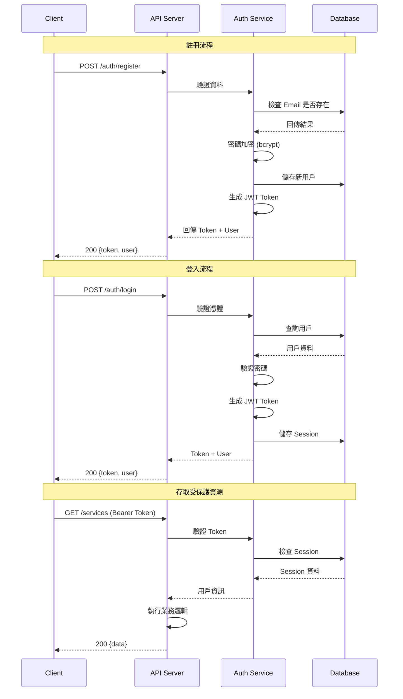
```mermaid
sequenceDiagram
    participant C as Client
    participant API as API Server
    participant Auth as Auth Service
    participant DB as Database

    Note over C,DB: 註冊流程
    C->>API: POST /auth/register
    API->>Auth: 驗證資料
    Auth->>DB: 檢查 Email 是否存在
    DB-->>Auth: 回傳結果
    Auth->>Auth: 密碼加密 (bcrypt)
    Auth->>DB: 儲存新用戶
    Auth->>Auth: 生成 JWT Token
    Auth-->>API: 回傳 Token + User
    API-->>C: 200 {token, user}

    Note over C,DB: 登入流程
    C->>API: POST /auth/login
    API->>Auth: 驗證憑證
    Auth->>DB: 查詢用戶
    DB-->>Auth: 用戶資料
    Auth->>Auth: 驗證密碼
    Auth->>Auth: 生成 JWT Token
    Auth->>DB: 儲存 Session
    Auth-->>API: Token + User
    API-->>C: 200 {token, user}

    Note over C,DB: 存取受保護資源
    C->>API: GET /services (Bearer Token)
    API->>Auth: 驗證 Token
    Auth->>DB: 檢查 Session
    DB-->>Auth: Session 資料
    Auth-->>API: 用戶資訊
    API->>API: 執行業務邏輯
    API-->>C: 200 {data}
```

### API 請求範例

#### 註冊新用戶

```bash
curl -X POST http://localhost:3000/auth/register \
  -H "Content-Type: application/json" \
  -d '{
    "email": "user@example.com",
    "password": "SecurePass123!",
    "name": "張小明"
  }'
```

**回應範例：**
```json
{
  "success": true,
  "data": {
    "user": {
      "id": "550e8400-e29b-41d4-a716-446655440000",
      "email": "user@example.com",
      "name": "張小明",
      "createdAt": "2024-01-01T00:00:00.000Z"
    },
    "token": "eyJhbGciOiJIUzI1NiIsInR5cCI6IkpXVCJ9..."
  }
}
```

#### 登入

```bash
curl -X POST http://localhost:3000/auth/login \
  -H "Content-Type: application/json" \
  -d '{
    "email": "user@example.com",
    "password": "SecurePass123!"
  }'
```

#### 查詢服務列表

```bash
curl -X GET http://localhost:3000/services \
  -H "Authorization: Bearer YOUR_JWT_TOKEN"
```

**回應範例：**
```json
{
  "success": true,
  "data": [
    {
      "id": "123e4567-e89b-12d3-a456-426614174000",
      "name": "網站開發服務",
      "description": "提供專業的網站開發服務",
      "price": 50000,
      "duration": 120,
      "isActive": true,
      "createdAt": "2024-01-01T00:00:00.000Z"
    }
  ],
  "pagination": {
    "total": 10,
    "page": 1,
    "pageSize": 10
  }
}
```

### 錯誤處理

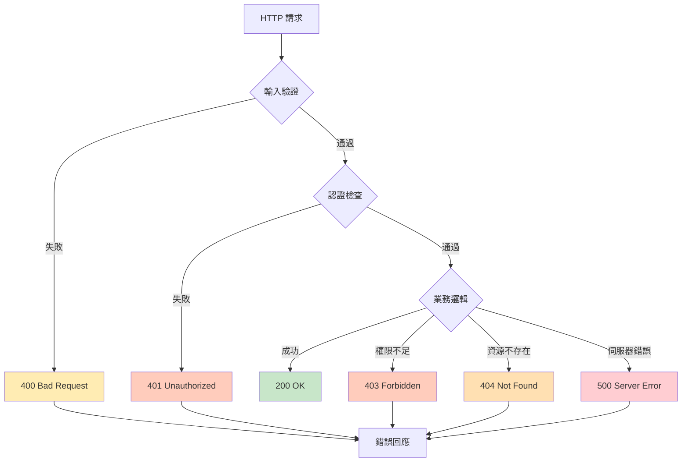
```mermaid
flowchart TD
    Request[HTTP 請求] --> Validation{輸入驗證}

    Validation -->|通過| Auth{認證檢查}
    Validation -->|失敗| Error400[400 Bad Request]

    Auth -->|通過| Business{業務邏輯}
    Auth -->|失敗| Error401[401 Unauthorized]

    Business -->|成功| Success[200 OK]
    Business -->|資源不存在| Error404[404 Not Found]
    Business -->|權限不足| Error403[403 Forbidden]
    Business -->|伺服器錯誤| Error500[500 Server Error]

    Error400 --> ErrorResponse[錯誤回應]
    Error401 --> ErrorResponse
    Error403 --> ErrorResponse
    Error404 --> ErrorResponse
    Error500 --> ErrorResponse

    style Success fill:#c8e6c9
    style Error400 fill:#ffecb3
    style Error401 fill:#ffccbc
    style Error403 fill:#ffccbc
    style Error404 fill:#ffe0b2
    style Error500 fill:#ffcdd2
```

### 錯誤回應格式

```json
{
  "success": false,
  "error": {
    "code": "VALIDATION_ERROR",
    "message": "輸入資料驗證失敗",
    "details": [
      {
        "field": "email",
        "message": "請輸入有效的電子郵件"
      }
    ]
  },
  "timestamp": "2024-01-01T00:00:00.000Z",
  "path": "/auth/register"
}
```

---

## 💻 開發指南

### 開發環境設定

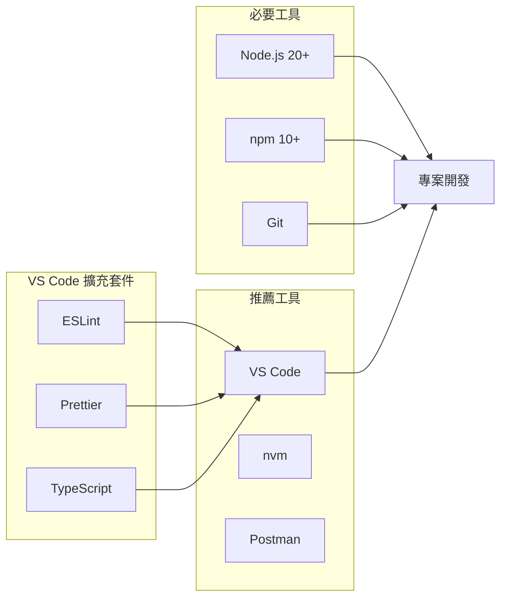
```mermaid
flowchart LR
    subgraph "必要工具"
        Node["Node.js 20+"]
        NPM["npm 10+"]
        Git["Git"]
    end

    subgraph "推薦工具"
        VSCode["VS Code"]
        NVM["nvm"]
        Postman["Postman"]
    end

    subgraph "VS Code 擴充套件"
        ESLint_Ext["ESLint"]
        Prettier_Ext["Prettier"]
        TS_Ext["TypeScript"]
    end

    Node --> Project[專案開發]
    NPM --> Project
    Git --> Project
    VSCode --> Project

    ESLint_Ext --> VSCode
    Prettier_Ext --> VSCode
    TS_Ext --> VSCode
```

### 開發指令

| 指令 | 說明 | 用途 |
|------|------|------|
| `npm run dev` | 開發模式 | 啟動開發伺服器（熱重載） |
| `npm run build` | 建置專案 | 編譯 TypeScript 為 JavaScript |
| `npm start` | 正式環境 | 執行編譯後的程式 |
| `npm test` | 執行測試 | 運行所有測試案例 |
| `npm run test:watch` | 監視測試 | 自動重新執行測試 |
| `npm run lint` | 程式碼檢查 | 檢查程式碼風格 |
| `npm run lint:fix` | 自動修正 | 自動修正程式碼問題 |
| `npm run format` | 格式化 | 使用 Prettier 格式化 |

### Git 工作流程

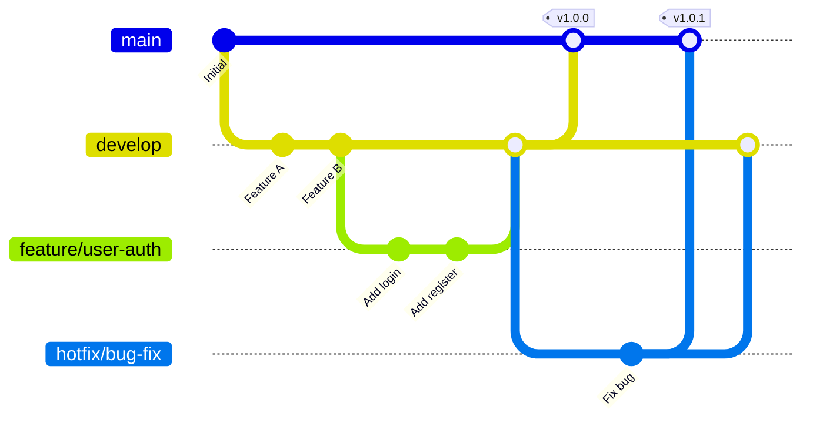
```mermaid
gitGraph
    commit id: "Initial"
    branch develop
    checkout develop
    commit id: "Feature A"
    commit id: "Feature B"
    branch feature/user-auth
    checkout feature/user-auth
    commit id: "Add login"
    commit id: "Add register"
    checkout develop
    merge feature/user-auth
    checkout main
    merge develop tag: "v1.0.0"
    checkout develop
    branch hotfix/bug-fix
    checkout hotfix/bug-fix
    commit id: "Fix bug"
    checkout main
    merge hotfix/bug-fix tag: "v1.0.1"
    checkout develop
    merge hotfix/bug-fix
```

### 程式碼風格規範

#### TypeScript 最佳實踐

```typescript
// ✅ 好的做法
interface UserData {
  id: string;
  email: string;
  name: string;
}

class UserService {
  async createUser(data: UserData): Promise<User> {
    // 實作...
  }
}

// ❌ 避免的做法
class UserService {
  async createUser(data: any): Promise<any> {
    // 沒有型別安全
  }
}
```

#### 錯誤處理

```typescript
// ✅ 好的錯誤處理
try {
  const user = await userService.createUser(data);
  return { success: true, data: user };
} catch (error) {
  logger.error('Failed to create user:', error);
  throw new AppError('USER_CREATE_FAILED', 'Unable to create user');
}

// ❌ 避免的做法
try {
  const user = await userService.createUser(data);
  return user;
} catch (e) {
  console.log(e);
  throw e;
}
```

---

## 🧪 測試策略

### 測試金字塔

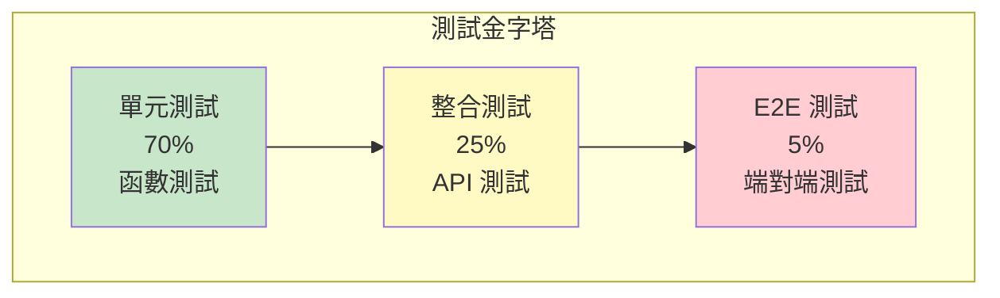
```mermaid
flowchart TB
    subgraph "測試金字塔"
        E2E["E2E 測試<br/>5%<br/>端對端測試"]
        Integration["整合測試<br/>25%<br/>API 測試"]
        Unit["單元測試<br/>70%<br/>函數測試"]
    end

    Unit --> Integration
    Integration --> E2E

    style E2E fill:#ffcdd2
    style Integration fill:#fff9c4
    style Unit fill:#c8e6c9
```

### 測試執行流程

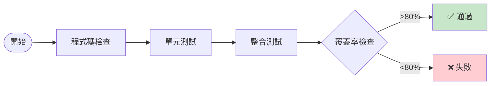
```mermaid
flowchart LR
    Start([開始]) --> Lint[程式碼檢查]
    Lint --> Unit[單元測試]
    Unit --> Integration[整合測試]
    Integration --> Coverage{覆蓋率檢查}
    Coverage -->|>80%| Pass[✅ 通過]
    Coverage -->|<80%| Fail[❌ 失敗]

    style Pass fill:#c8e6c9
    style Fail fill:#ffcdd2
```

### 測試指令

```bash
# 執行所有測試
npm test

# 執行單元測試
npm test -- --testPathPattern=unit

# 執行整合測試
npm test -- --testPathPattern=integration

# 產生覆蓋率報告
npm test -- --coverage

# 監視模式（開發時使用）
npm run test:watch
```

### 測試範例

#### 單元測試

```typescript
// user.service.test.ts
describe('UserService', () => {
  let userService: UserService;

  beforeEach(() => {
    userService = new UserService();
  });

  describe('createUser', () => {
    it('should create a new user with hashed password', async () => {
      const userData = {
        email: 'test@example.com',
        password: 'password123',
        name: 'Test User'
      };

      const user = await userService.createUser(userData);

      expect(user.email).toBe(userData.email);
      expect(user.password).not.toBe(userData.password); // 密碼已加密
    });

    it('should throw error if email already exists', async () => {
      const userData = {
        email: 'existing@example.com',
        password: 'password123',
        name: 'Test User'
      };

      await expect(userService.createUser(userData))
        .rejects.toThrow('Email already registered');
    });
  });
});
```

#### 整合測試

```typescript
// auth.integration.test.ts
describe('Auth API', () => {
  describe('POST /auth/register', () => {
    it('should register a new user', async () => {
      const response = await request(app)
        .post('/auth/register')
        .send({
          email: 'newuser@example.com',
          password: 'SecurePass123!',
          name: 'New User'
        });

      expect(response.status).toBe(201);
      expect(response.body.success).toBe(true);
      expect(response.body.data).toHaveProperty('token');
      expect(response.body.data).toHaveProperty('user');
    });
  });
});
```

---

## 🔄 CI/CD 流程

### CI/CD Pipeline


```mermaid
flowchart LR
    subgraph "開發階段"
        Dev[本地開發]
        Commit[Git Commit]
        Push[Git Push]
    end

    subgraph "CI Pipeline"
        Trigger[觸發 CI]
        Install[安裝依賴]
        Lint[程式碼檢查]
        Test[執行測試]
        Build[建置專案]
        Security[安全掃描]
    end

    subgraph "CD Pipeline"
        Docker[建置映像]
        Registry[推送映像]
        Deploy[部署]
        Health[健康檢查]
    end

    Dev --> Commit --> Push
    Push --> Trigger
    Trigger --> Install
    Install --> Lint
    Lint --> Test
    Test --> Build
    Build --> Security
    Security --> Docker
    Docker --> Registry
    Registry --> Deploy
    Deploy --> Health

    style Dev fill:#e3f2fd
    style Test fill:#fff9c4
    style Deploy fill:#c8e6c9
```

### GitHub Actions 設定

```yaml
# .github/workflows/ci-cd.yml
name: CI/CD Pipeline

on:
  push:
    branches: [main, develop]
  pull_request:
    branches: [main]

jobs:
  test:
    runs-on: ubuntu-latest

    steps:
      - uses: actions/checkout@v3

      - name: Setup Node.js
        uses: actions/setup-node@v3
        with:
          node-version: '20'
          cache: 'npm'

      - name: Install dependencies
        run: npm ci

      - name: Run linter
        run: npm run lint

      - name: Run tests
        run: npm test -- --coverage
        env:
          NODE_ENV: test
          DB_PATH: ':memory:'

      - name: Upload coverage
        uses: codecov/codecov-action@v3
        with:
          file: ./coverage/coverage-final.json

  build:
    needs: test
    runs-on: ubuntu-latest
    if: github.ref == 'refs/heads/main'

    steps:
      - uses: actions/checkout@v3

      - name: Set up Docker Buildx
        uses: docker/setup-buildx-action@v2

      - name: Login to Docker Hub
        uses: docker/login-action@v2
        with:
          username: ${{ secrets.DOCKER_USERNAME }}
          password: ${{ secrets.DOCKER_PASSWORD }}

      - name: Build and push
        uses: docker/build-push-action@v4
        with:
          context: .
          push: true
          tags: |
            ${{ secrets.DOCKER_USERNAME }}/service-booking-api:latest
            ${{ secrets.DOCKER_USERNAME }}/service-booking-api:${{ github.sha }}
```

### 環境管理

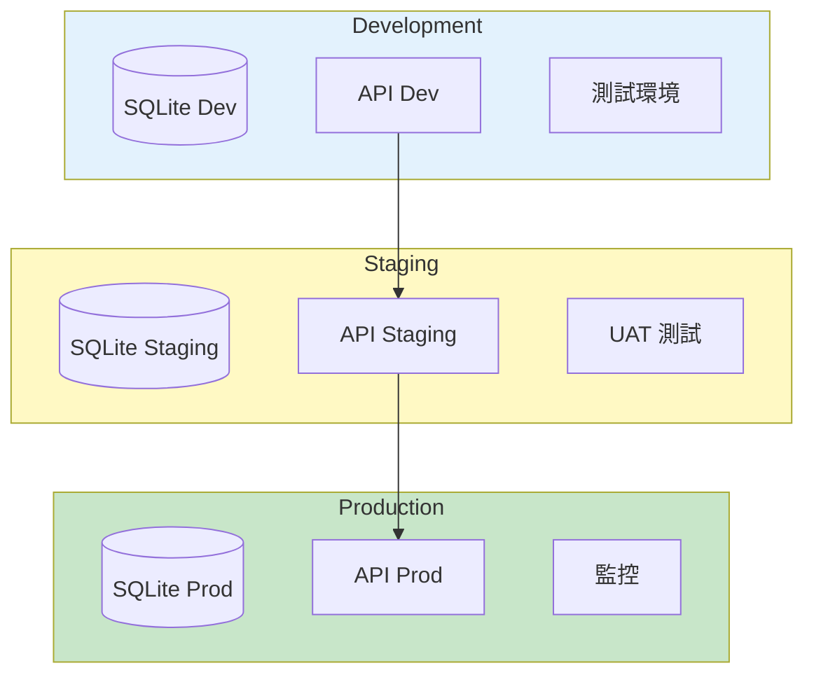
```mermaid
flowchart TD
    subgraph "Development"
        Dev_DB[(SQLite Dev)]
        Dev_API[API Dev]
        Dev_Test[測試環境]
    end

    subgraph "Staging"
        Stg_DB[(SQLite Staging)]
        Stg_API[API Staging]
        Stg_Test[UAT 測試]
    end

    subgraph "Production"
        Prod_DB[(SQLite Prod)]
        Prod_API[API Prod]
        Prod_Monitor[監控]
    end

    Dev_API --> Stg_API
    Stg_API --> Prod_API

    style Development fill:#e3f2fd
    style Staging fill:#fff9c4
    style Production fill:#c8e6c9
```

---

## 🐳 Docker 容器化

### Docker 架構

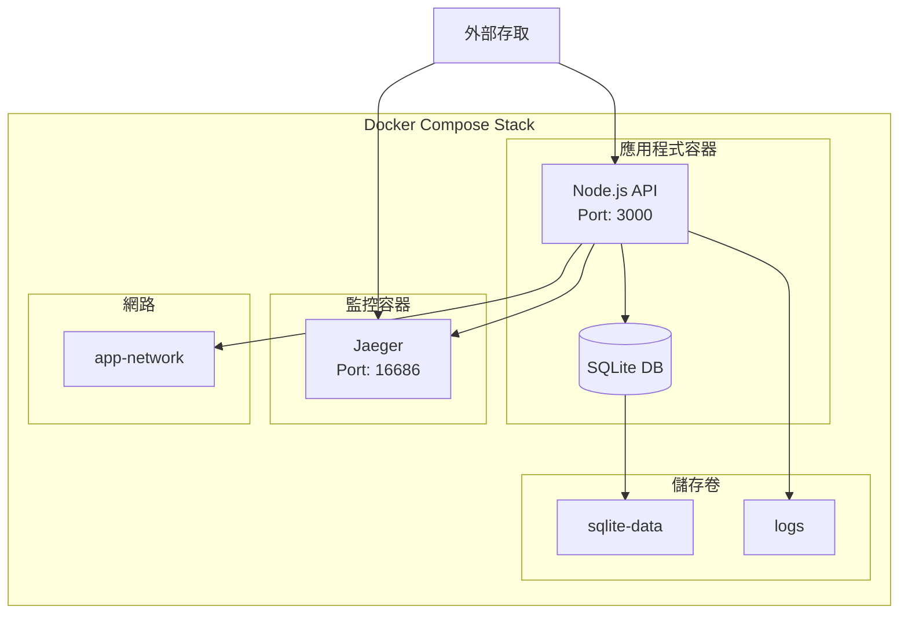
```mermaid
flowchart TB
    subgraph "Docker Compose Stack"
        subgraph "應用程式容器"
            API[Node.js API<br/>Port: 3000]
            SQLite[(SQLite DB)]
        end

        subgraph "監控容器"
            Jaeger[Jaeger<br/>Port: 16686]
        end

        subgraph "網路"
            Network[app-network]
        end

        subgraph "儲存卷"
            Volume1[sqlite-data]
            Volume2[logs]
        end
    end

    API --> SQLite
    API --> Jaeger
    API --> Network
    SQLite --> Volume1
    API --> Volume2

    External[外部存取] --> API
    External --> Jaeger
```

### Dockerfile

```dockerfile
# Multi-stage build for production
FROM node:20-alpine AS builder

WORKDIR /app

# Copy package files
COPY package*.json ./

# Install dependencies
RUN npm ci --only=production

# Copy source code
COPY . .

# Build TypeScript
RUN npm run build

# Production stage
FROM node:20-alpine

WORKDIR /app

# Copy built application
COPY --from=builder /app/dist ./dist
COPY --from=builder /app/node_modules ./node_modules
COPY --from=builder /app/package*.json ./

# Create data directory
RUN mkdir -p /app/data

# Health check
HEALTHCHECK --interval=30s --timeout=3s --start-period=5s --retries=3 \
  CMD node -e "require('http').get('http://localhost:3000/health', (r) => {process.exit(r.statusCode === 200 ? 0 : 1)})"

# Expose port
EXPOSE 3000

# Start application
CMD ["node", "dist/index.js"]
```

### Docker Compose

```yaml
# docker-compose.yml
version: '3.8'

services:
  api:
    build: .
    container_name: service-booking-api
    ports:
      - "3000:3000"
    environment:
      - NODE_ENV=production
      - DB_PATH=/app/data/database.sqlite
      - CACHE_DB_PATH=/app/data/cache.sqlite
      - JAEGER_AGENT_HOST=jaeger
    volumes:
      - sqlite-data:/app/data
      - ./logs:/app/logs
    depends_on:
      - jaeger
    networks:
      - app-network
    restart: unless-stopped

  jaeger:
    image: jaegertracing/all-in-one:latest
    container_name: jaeger
    ports:
      - "16686:16686"
      - "14268:14268"
    networks:
      - app-network

networks:
  app-network:
    driver: bridge

volumes:
  sqlite-data:
  logs:
```

### Docker 指令

```bash
# 建置映像
docker build -t service-booking-api .

# 執行容器
docker run -p 3000:3000 service-booking-api

# 使用 Docker Compose
docker-compose up -d

# 查看日誌
docker-compose logs -f api

# 停止服務
docker-compose down
```

---

## 📊 監控與維運

### 監控架構

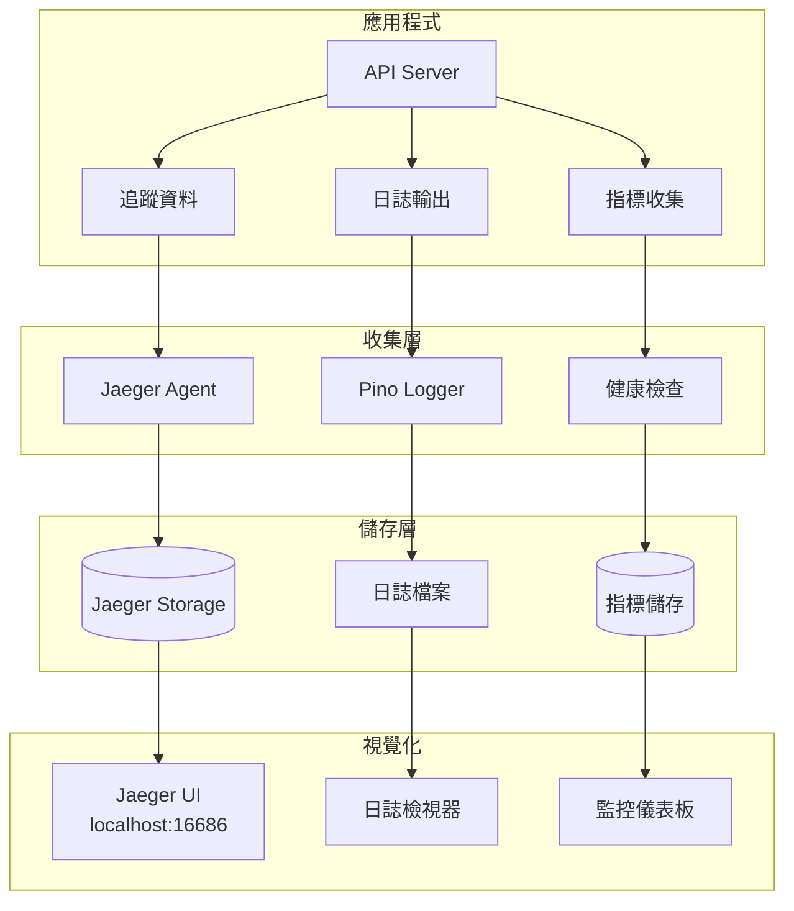
```mermaid
flowchart TB
    subgraph "應用程式"
        API[API Server]
        Metrics[指標收集]
        Logs[日誌輸出]
        Traces[追蹤資料]
    end

    subgraph "收集層"
        Pino[Pino Logger]
        Jaeger_Agent[Jaeger Agent]
        Health_Check[健康檢查]
    end

    subgraph "儲存層"
        LogFiles[日誌檔案]
        JaegerDB[(Jaeger Storage)]
        MetricsDB[(指標儲存)]
    end

    subgraph "視覺化"
        Jaeger_UI[Jaeger UI<br/>localhost:16686]
        LogViewer[日誌檢視器]
        Dashboard[監控儀表板]
    end

    API --> Metrics
    API --> Logs
    API --> Traces

    Logs --> Pino
    Traces --> Jaeger_Agent
    Metrics --> Health_Check

    Pino --> LogFiles
    Jaeger_Agent --> JaegerDB
    Health_Check --> MetricsDB

    LogFiles --> LogViewer
    JaegerDB --> Jaeger_UI
    MetricsDB --> Dashboard
```

### 健康檢查端點

```bash
# 健康狀態
GET /health

# 回應範例
{
  "status": "healthy",
  "timestamp": "2024-01-01T00:00:00.000Z",
  "uptime": 3600,
  "services": {
    "database": "healthy",
    "cache": "healthy"
  },
  "memory": {
    "used": 45.2,
    "total": 512,
    "unit": "MB"
  }
}
```

### Jaeger 分散式追蹤

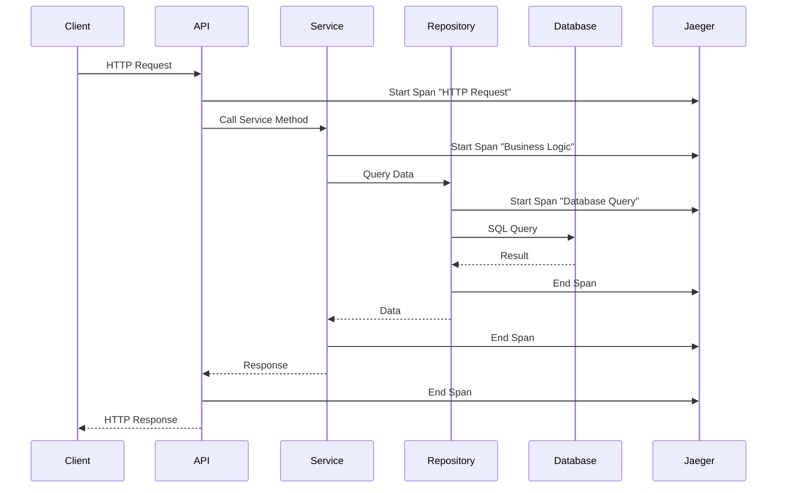
```mermaid
sequenceDiagram
    participant Client
    participant API
    participant Service
    participant Repository
    participant Database
    participant Jaeger

    Client->>API: HTTP Request
    API->>Jaeger: Start Span "HTTP Request"
    API->>Service: Call Service Method
    Service->>Jaeger: Start Span "Business Logic"
    Service->>Repository: Query Data
    Repository->>Jaeger: Start Span "Database Query"
    Repository->>Database: SQL Query
    Database-->>Repository: Result
    Repository->>Jaeger: End Span
    Repository-->>Service: Data
    Service->>Jaeger: End Span
    Service-->>API: Response
    API->>Jaeger: End Span
    API-->>Client: HTTP Response
```

### 日誌管理

```typescript
// 結構化日誌範例
logger.info({
  msg: 'User login successful',
  userId: user.id,
  email: user.email,
  ip: ctx.ip,
  timestamp: new Date().toISOString()
});

logger.error({
  msg: 'Database connection failed',
  error: error.message,
  stack: error.stack,
  retryCount: 3
});
```

---

## 🎓 學習路線圖

### 技術學習路徑

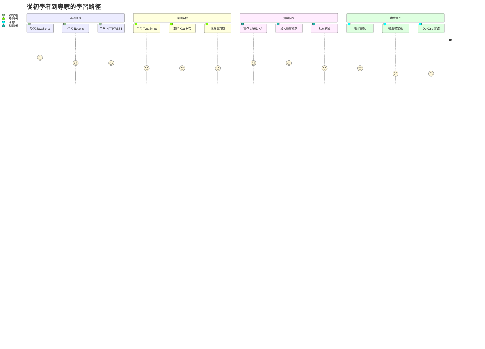
```mermaid
journey
    title 從初學者到專家的學習路徑

    section 基礎階段
      學習 JavaScript: 5: 初學者
      學習 Node.js: 4: 初學者
      了解 HTTP/REST: 4: 初學者

    section 進階階段
      學習 TypeScript: 3: 學習者
      掌握 Koa 框架: 3: 學習者
      理解資料庫: 3: 學習者

    section 實戰階段
      實作 CRUD API: 4: 開發者
      加入認證機制: 4: 開發者
      編寫測試: 3: 開發者

    section 專業階段
      效能優化: 3: 專家
      微服務架構: 2: 專家
      DevOps 實踐: 2: 專家
```

### 推薦學習資源

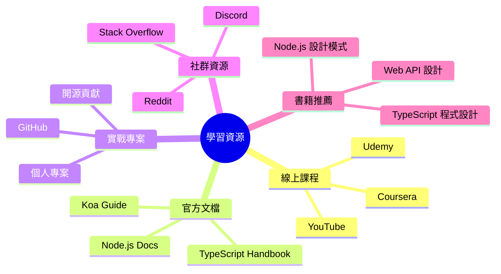
```mermaid
mindmap
  root((學習資源))
    線上課程
      Udemy
      Coursera
      YouTube
    官方文檔
      Node.js Docs
      TypeScript Handbook
      Koa Guide
    實戰專案
      GitHub
      開源貢獻
      個人專案
    社群資源
      Stack Overflow
      Reddit
      Discord
    書籍推薦
      Node.js 設計模式
      TypeScript 程式設計
      Web API 設計
```

### 技能樹

| 階段 | 技能 | 學習時間 | 重要性 |
|------|------|----------|--------|
| 🌱 基礎 | JavaScript | 1-2 個月 | ⭐⭐⭐⭐⭐ |
| 🌱 基礎 | Node.js | 2-3 週 | ⭐⭐⭐⭐⭐ |
| 🌱 基礎 | Git | 1 週 | ⭐⭐⭐⭐⭐ |
| 🌿 進階 | TypeScript | 2-3 週 | ⭐⭐⭐⭐ |
| 🌿 進階 | SQL/SQLite | 2 週 | ⭐⭐⭐⭐ |
| 🌿 進階 | REST API | 1-2 週 | ⭐⭐⭐⭐ |
| 🌳 專業 | 測試 | 2-3 週 | ⭐⭐⭐ |
| 🌳 專業 | Docker | 1-2 週 | ⭐⭐⭐ |
| 🌳 專業 | CI/CD | 1-2 週 | ⭐⭐⭐ |

---

## ❓ 常見問題

### 問題診斷流程

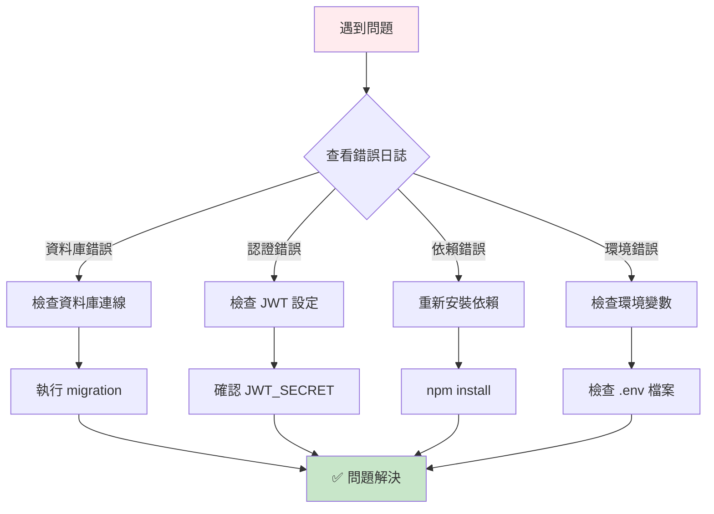
```mermaid
flowchart TD
    Start[遇到問題] --> CheckLogs{查看錯誤日誌}

    CheckLogs -->|資料庫錯誤| DBIssue[檢查資料庫連線]
    CheckLogs -->|認證錯誤| AuthIssue[檢查 JWT 設定]
    CheckLogs -->|依賴錯誤| DepIssue[重新安裝依賴]
    CheckLogs -->|環境錯誤| EnvIssue[檢查環境變數]

    DBIssue --> RunMigration[執行 migration]
    AuthIssue --> CheckSecret[確認 JWT_SECRET]
    DepIssue --> NpmInstall[npm install]
    EnvIssue --> CheckEnv[檢查 .env 檔案]

    RunMigration --> Solved[✅ 問題解決]
    CheckSecret --> Solved
    NpmInstall --> Solved
    CheckEnv --> Solved

    style Start fill:#ffebee
    style Solved fill:#c8e6c9
```

### 常見錯誤與解決方案

<details>
<summary>🔴 錯誤：Cannot find module</summary>

**原因：** 缺少依賴套件

**解決方案：**
```bash
# 刪除 node_modules 和 package-lock.json
rm -rf node_modules package-lock.json

# 重新安裝
npm install
```
</details>

<details>
<summary>🔴 錯誤：Database connection failed</summary>

**原因：** 資料庫未初始化

**解決方案：**
```bash
# 執行遷移
npm run migrate

# 確認資料庫檔案存在
ls -la database.sqlite
```
</details>

<details>
<summary>🔴 錯誤：JWT_SECRET is not defined</summary>

**原因：** 環境變數未設定

**解決方案：**
```bash
# 複製環境變數範本
cp .env.example .env

# 編輯 .env 檔案
# 設定 JWT_SECRET=your-secret-key
```
</details>

<details>
<summary>🔴 錯誤：Port 3000 is already in use</summary>

**原因：** 埠號已被佔用

**解決方案：**
```bash
# 找出佔用埠號的程序
lsof -i :3000

# 終止程序
kill -9 <PID>

# 或更改埠號
PORT=3001 npm run dev
```
</details>

---

## 🤝 貢獻指南

### 貢獻流程

```mermaid
flowchart LR
    Fork[Fork 專案] --> Clone[Clone 到本地]
    Clone --> Branch[建立分支]
    Branch --> Code[撰寫程式碼]
    Code --> Test[執行測試]
    Test --> Commit[提交變更]
    Commit --> Push[推送分支]
    Push --> PR[建立 Pull Request]
    PR --> Review[程式碼審查]
    Review --> Merge[合併到主分支]

    style Fork fill:#e3f2fd
    style Test fill:#fff9c4
    style Merge fill:#c8e6c9
```

### 提交規範

```bash
# 提交訊息格式
<type>(<scope>): <subject>

# 範例
feat(auth): add refresh token functionality
fix(service): resolve null pointer exception
docs(readme): update installation guide
test(user): add unit tests for user service
```

**Type 類型：**
- `feat`: 新功能
- `fix`: 修復錯誤
- `docs`: 文檔更新
- `style`: 程式碼風格調整
- `refactor`: 重構
- `test`: 測試相關
- `chore`: 其他變更

### 程式碼審查標準

```mermaid
flowchart TD
    PR[Pull Request] --> Checks{自動檢查}

    Checks --> Lint[程式碼風格]
    Checks --> Test[測試通過]
    Checks --> Coverage[覆蓋率]
    Checks --> Build[建置成功]

    Lint -->|✅| Review[人工審查]
    Test -->|✅| Review
    Coverage -->|>80%| Review
    Build -->|✅| Review

    Review --> Feedback{審查結果}
    Feedback -->|需修改| Revise[修改程式碼]
    Feedback -->|通過| Approve[批准合併]

    Revise --> Checks
    Approve --> Merge[合併到主分支]

    style Merge fill:#c8e6c9
```

---

## 📚 相關資源

### 技術文檔
- [Node.js 官方文檔](https://nodejs.org/docs)
- [TypeScript 手冊](https://www.typescriptlang.org/docs)
- [Koa 官方指南](https://koajs.com)
- [Sequelize 文檔](https://sequelize.org)
- [JWT 介紹](https://jwt.io)

### 學習資源
- [MDN Web Docs](https://developer.mozilla.org)
- [JavaScript Info](https://javascript.info)
- [Node.js Best Practices](https://github.com/goldbergyoni/nodebestpractices)

### 社群支援
- [Stack Overflow](https://stackoverflow.com)
- [GitHub Discussions](https://github.com/discussions)
- [Reddit r/node](https://reddit.com/r/node)

---

## 📄 授權

本專案採用 MIT License 授權 - 詳見 [LICENSE](LICENSE) 檔案

---

## 🙏 致謝

感謝所有貢獻者和開源社群的支持！

---

<div align="center">

**Happy Coding! 🚀**

如果這個專案對你有幫助，請給我們一個 ⭐

[回到頂部](#-service-booking-api---服務預約管理系統)

</div>