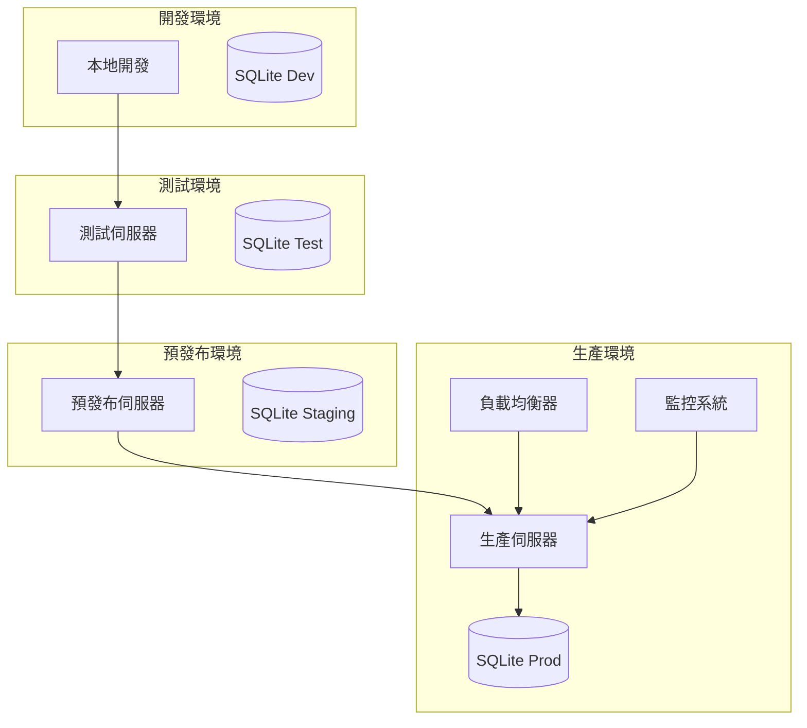

# 部署指南

## 概述

本指南詳細說明如何將 Service Booking API 部署到不同的環境，包括開發、測試、預發布和生產環境。

## 部署架構



## 環境需求

### 系統需求
- **作業系統**: Linux (Ubuntu 20.04+ 推薦) 或 macOS
- **Node.js**: 20.10.0 或更高版本
- **記憶體**: 最少 512MB，推薦 1GB+
- **儲存空間**: 最少 1GB 可用空間
- **網路**: 對外開放的 HTTP/HTTPS 埠

### 軟體依賴
- Node.js 和 npm
- PM2 (生產環境程序管理)
- Nginx (反向代理，可選)
- SSL 憑證 (HTTPS，推薦)

## 本地開發環境

### 1. 環境設定

```bash
# 克隆專案
git clone https://github.com/yourusername/service-booking-api.git
cd service-booking-api

# 安裝依賴
npm install

# 複製環境變數
cp .env.example .env
```

### 2. 環境變數設定

編輯 `.env` 檔案：

```env
# 應用程式設定
NODE_ENV=development
PORT=3000

# 資料庫設定
DATABASE_URL=sqlite:./database.sqlite

# JWT 設定
JWT_SECRET=your-development-secret-key
JWT_EXPIRES_IN=24h

# 密碼加密設定
BCRYPT_ROUNDS=12

# 日誌設定
LOG_LEVEL=debug
```

### 3. 初始化和啟動

```bash
# 初始化資料庫
npm run migrate
npm run seed

# 啟動開發伺服器
npm run dev
```

## Docker 部署

### 1. 建置 Docker 映像

```bash
# 建置映像
docker build -t service-booking-api:latest .

# 或使用特定版本標籤
docker build -t service-booking-api:v1.0.0 .
```

### 2. 使用 Docker Compose

建立 `docker-compose.prod.yml`：

```yaml
version: '3.8'

services:
  api:
    build: .
    container_name: service-booking-api-prod
    ports:
      - "3000:3000"
    environment:
      - NODE_ENV=production
      - PORT=3000
      - DATABASE_URL=sqlite:/app/data/database.sqlite
      - JWT_SECRET=${JWT_SECRET}
      - JWT_EXPIRES_IN=24h
      - BCRYPT_ROUNDS=12
      - LOG_LEVEL=info
    volumes:
      - sqlite-data:/app/data
      - ./logs:/app/logs
    restart: unless-stopped
    healthcheck:
      test: ["CMD", "node", "-e", "require('http').get('http://localhost:3000/health', (r) => {process.exit(r.statusCode === 200 ? 0 : 1)})"]
      interval: 30s
      timeout: 10s
      retries: 3
      start_period: 40s

  nginx:
    image: nginx:alpine
    container_name: nginx-proxy
    ports:
      - "80:80"
      - "443:443"
    volumes:
      - ./nginx.conf:/etc/nginx/nginx.conf
      - ./ssl:/etc/nginx/ssl
    depends_on:
      - api
    restart: unless-stopped

volumes:
  sqlite-data:
```

### 3. 啟動服務

```bash
# 設定環境變數
export JWT_SECRET="your-production-secret-key"

# 啟動服務
docker-compose -f docker-compose.prod.yml up -d

# 查看日誌
docker-compose -f docker-compose.prod.yml logs -f
```

## 傳統伺服器部署

### 1. 伺服器準備

```bash
# 更新系統
sudo apt update && sudo apt upgrade -y

# 安裝 Node.js (使用 NodeSource repository)
curl -fsSL https://deb.nodesource.com/setup_20.x | sudo -E bash -
sudo apt-get install -y nodejs

# 安裝 PM2
sudo npm install -g pm2

# 建立應用程式目錄
sudo mkdir -p /var/www/service-booking-api
sudo chown $USER:$USER /var/www/service-booking-api
```

### 2. 部署應用程式

```bash
# 進入應用程式目錄
cd /var/www/service-booking-api

# 克隆或上傳程式碼
git clone https://github.com/yourusername/service-booking-api.git .

# 安裝依賴
npm ci --only=production

# 建置應用程式
npm run build

# 設定環境變數
cp .env.example .env
# 編輯 .env 檔案設定生產環境變數
```

### 3. 環境變數設定（生產環境）

```env
# 應用程式設定
NODE_ENV=production
PORT=3000

# 資料庫設定
DATABASE_URL=sqlite:/var/www/service-booking-api/data/database.sqlite

# JWT 設定 (使用強隨機密鑰)
JWT_SECRET=your-super-secure-production-secret-key-256-bits-long
JWT_EXPIRES_IN=24h

# 密碼加密設定
BCRYPT_ROUNDS=12

# 日誌設定
LOG_LEVEL=info
LOG_FILE=/var/www/service-booking-api/logs/app.log

# CORS 設定
CORS_ORIGIN=https://yourdomain.com

# 速率限制
RATE_LIMIT_WINDOW_MS=900000
RATE_LIMIT_MAX_REQUESTS=100
```

### 4. 初始化資料庫

```bash
# 建立資料目錄
mkdir -p data logs

# 執行資料庫遷移
npm run migrate

# 載入生產資料（如果需要）
npm run seed
```

### 5. 使用 PM2 管理程序

建立 `ecosystem.config.js`：

```javascript
module.exports = {
  apps: [{
    name: 'service-booking-api',
    script: 'dist/index.js',
    instances: 'max',
    exec_mode: 'cluster',
    env: {
      NODE_ENV: 'production',
      PORT: 3000
    },
    error_file: './logs/err.log',
    out_file: './logs/out.log',
    log_file: './logs/combined.log',
    time: true,
    max_memory_restart: '1G',
    node_args: '--max-old-space-size=1024'
  }]
};
```

啟動應用程式：

```bash
# 啟動應用程式
pm2 start ecosystem.config.js

# 儲存 PM2 設定
pm2 save

# 設定開機自動啟動
pm2 startup
sudo env PATH=$PATH:/usr/bin /usr/lib/node_modules/pm2/bin/pm2 startup systemd -u $USER --hp $HOME

# 查看狀態
pm2 status
pm2 logs
```

## Nginx 反向代理設定

### 1. 安裝 Nginx

```bash
sudo apt install nginx -y
```

### 2. 設定 Nginx

建立 `/etc/nginx/sites-available/service-booking-api`：

```nginx
server {
    listen 80;
    server_name yourdomain.com www.yourdomain.com;

    # 重導向到 HTTPS
    return 301 https://$server_name$request_uri;
}

server {
    listen 443 ssl http2;
    server_name yourdomain.com www.yourdomain.com;

    # SSL 設定
    ssl_certificate /etc/ssl/certs/yourdomain.com.crt;
    ssl_certificate_key /etc/ssl/private/yourdomain.com.key;
    ssl_protocols TLSv1.2 TLSv1.3;
    ssl_ciphers ECDHE-RSA-AES256-GCM-SHA512:DHE-RSA-AES256-GCM-SHA512:ECDHE-RSA-AES256-GCM-SHA384:DHE-RSA-AES256-GCM-SHA384;
    ssl_prefer_server_ciphers off;

    # 安全標頭
    add_header X-Frame-Options DENY;
    add_header X-Content-Type-Options nosniff;
    add_header X-XSS-Protection "1; mode=block";
    add_header Strict-Transport-Security "max-age=63072000; includeSubDomains; preload";

    # 反向代理設定
    location / {
        proxy_pass http://localhost:3000;
        proxy_http_version 1.1;
        proxy_set_header Upgrade $http_upgrade;
        proxy_set_header Connection 'upgrade';
        proxy_set_header Host $host;
        proxy_set_header X-Real-IP $remote_addr;
        proxy_set_header X-Forwarded-For $proxy_add_x_forwarded_for;
        proxy_set_header X-Forwarded-Proto $scheme;
        proxy_cache_bypass $http_upgrade;
        
        # 超時設定
        proxy_connect_timeout 60s;
        proxy_send_timeout 60s;
        proxy_read_timeout 60s;
    }

    # 健康檢查端點
    location /health {
        proxy_pass http://localhost:3000/health;
        access_log off;
    }

    # 靜態檔案快取
    location ~* \.(js|css|png|jpg|jpeg|gif|ico|svg)$ {
        expires 1y;
        add_header Cache-Control "public, immutable";
    }

    # 日誌設定
    access_log /var/log/nginx/service-booking-api.access.log;
    error_log /var/log/nginx/service-booking-api.error.log;
}
```

### 3. 啟用網站

```bash
# 建立符號連結
sudo ln -s /etc/nginx/sites-available/service-booking-api /etc/nginx/sites-enabled/

# 測試設定
sudo nginx -t

# 重新載入 Nginx
sudo systemctl reload nginx
```

## SSL 憑證設定

### 使用 Let's Encrypt (推薦)

```bash
# 安裝 Certbot
sudo apt install certbot python3-certbot-nginx -y

# 取得憑證
sudo certbot --nginx -d yourdomain.com -d www.yourdomain.com

# 設定自動更新
sudo crontab -e
# 新增以下行：
# 0 12 * * * /usr/bin/certbot renew --quiet
```

## 監控和日誌

### 1. 應用程式監控

使用 PM2 監控：

```bash
# 即時監控
pm2 monit

# 查看日誌
pm2 logs service-booking-api

# 重啟應用程式
pm2 restart service-booking-api

# 查看詳細資訊
pm2 show service-booking-api
```

### 2. 系統監控

安裝系統監控工具：

```bash
# 安裝 htop
sudo apt install htop -y

# 安裝 iotop (磁碟 I/O 監控)
sudo apt install iotop -y

# 安裝 netstat
sudo apt install net-tools -y
```

### 3. 日誌管理

設定日誌輪轉：

建立 `/etc/logrotate.d/service-booking-api`：

```
/var/www/service-booking-api/logs/*.log {
    daily
    missingok
    rotate 52
    compress
    delaycompress
    notifempty
    create 644 www-data www-data
    postrotate
        pm2 reloadLogs
    endscript
}
```

## 備份策略

### 1. 資料庫備份

建立備份腳本 `backup.sh`：

```bash
#!/bin/bash

# 設定變數
BACKUP_DIR="/var/backups/service-booking-api"
DB_PATH="/var/www/service-booking-api/data/database.sqlite"
DATE=$(date +%Y%m%d_%H%M%S)

# 建立備份目錄
mkdir -p $BACKUP_DIR

# 備份資料庫
cp $DB_PATH $BACKUP_DIR/database_$DATE.sqlite

# 壓縮備份
gzip $BACKUP_DIR/database_$DATE.sqlite

# 刪除 30 天前的備份
find $BACKUP_DIR -name "database_*.sqlite.gz" -mtime +30 -delete

echo "Backup completed: database_$DATE.sqlite.gz"
```

設定定時備份：

```bash
# 設定執行權限
chmod +x backup.sh

# 新增到 crontab
crontab -e
# 新增以下行（每日凌晨 2 點備份）：
# 0 2 * * * /var/www/service-booking-api/backup.sh
```

### 2. 程式碼備份

```bash
# 備份整個應用程式目錄
tar -czf /var/backups/service-booking-api-$(date +%Y%m%d).tar.gz \
    --exclude=node_modules \
    --exclude=dist \
    --exclude=logs \
    /var/www/service-booking-api
```

## 更新部署

### 1. 零停機更新

```bash
# 進入應用程式目錄
cd /var/www/service-booking-api

# 拉取最新程式碼
git pull origin main

# 安裝新依賴
npm ci --only=production

# 建置應用程式
npm run build

# 執行資料庫遷移（如果有）
npm run migrate

# 重新載入 PM2 應用程式
pm2 reload service-booking-api
```

### 2. 自動化部署腳本

建立 `deploy.sh`：

```bash
#!/bin/bash

set -e

echo "Starting deployment..."

# 備份當前版本
cp -r /var/www/service-booking-api /var/backups/service-booking-api-$(date +%Y%m%d_%H%M%S)

# 進入應用程式目錄
cd /var/www/service-booking-api

# 拉取最新程式碼
git pull origin main

# 安裝依賴
npm ci --only=production

# 建置應用程式
npm run build

# 執行資料庫遷移
npm run migrate

# 執行測試
npm run test:ci

# 重新載入應用程式
pm2 reload service-booking-api

echo "Deployment completed successfully!"
```

## 安全性設定

### 1. 防火牆設定

```bash
# 安裝 UFW
sudo apt install ufw -y

# 設定預設規則
sudo ufw default deny incoming
sudo ufw default allow outgoing

# 允許 SSH
sudo ufw allow ssh

# 允許 HTTP 和 HTTPS
sudo ufw allow 80
sudo ufw allow 443

# 啟用防火牆
sudo ufw enable

# 查看狀態
sudo ufw status
```

### 2. 系統安全更新

```bash
# 設定自動安全更新
sudo apt install unattended-upgrades -y
sudo dpkg-reconfigure -plow unattended-upgrades
```

### 3. 應用程式安全

- 定期更新依賴套件：`npm audit fix`
- 使用強隨機的 JWT_SECRET
- 設定適當的 CORS 政策
- 實施速率限制
- 使用 HTTPS

## 效能優化

### 1. Node.js 優化

```bash
# 設定 Node.js 記憶體限制
export NODE_OPTIONS="--max-old-space-size=1024"

# 啟用 V8 優化
export NODE_OPTIONS="--optimize-for-size"
```

### 2. PM2 叢集模式

```javascript
// ecosystem.config.js
module.exports = {
  apps: [{
    name: 'service-booking-api',
    script: 'dist/index.js',
    instances: 'max', // 使用所有 CPU 核心
    exec_mode: 'cluster',
    max_memory_restart: '1G'
  }]
};
```

### 3. Nginx 快取

```nginx
# 在 Nginx 設定中新增
location ~* \.(js|css|png|jpg|jpeg|gif|ico|svg)$ {
    expires 1y;
    add_header Cache-Control "public, immutable";
}

# API 回應快取
location /api/ {
    proxy_cache api_cache;
    proxy_cache_valid 200 5m;
    proxy_cache_key $scheme$request_method$host$request_uri;
}
```

## 故障排除

### 常見問題

1. **應用程式無法啟動**
   - 檢查環境變數設定
   - 確認資料庫檔案權限
   - 查看 PM2 日誌

2. **資料庫連接失敗**
   - 檢查資料庫檔案路徑
   - 確認目錄權限
   - 執行資料庫遷移

3. **記憶體不足**
   - 增加伺服器記憶體
   - 調整 Node.js 記憶體限制
   - 優化應用程式程式碼

4. **SSL 憑證問題**
   - 檢查憑證有效期
   - 確認憑證檔案路徑
   - 重新產生憑證

### 日誌查看

```bash
# PM2 日誌
pm2 logs service-booking-api

# Nginx 日誌
sudo tail -f /var/log/nginx/service-booking-api.error.log

# 系統日誌
sudo journalctl -u nginx -f
```

---

**最後更新**: 2024-01-01  
**版本**: v1.0.0