# NodeJS 服務預約系統 - 完整實作指南

## 📋 目錄
- [專案概述](#專案概述)
- [系統架構](#系統架構)
- [技術棧](#技術棧)
- [資料庫設計](#資料庫設計)
- [API 設計](#api-設計)
- [認證與授權](#認證與授權)
- [增強功能](#增強功能)
- [測試策略](#測試策略)
- [監控與追蹤](#監控與追蹤)
- [CI/CD 與部署](#cicd-與部署)
- [進階未來發展](#進階未來發展)

## 專案概述

這是一個基於 TypeScript + Koa 的服務預約管理後端系統，提供完整的會員認證和服務管理功能。

### 核心功能
- 會員註冊與登入（JWT 認證）
- 服務（Service）完整 CRUD 操作
- 權限保護與驗證
- 完整的錯誤處理機制
- 分散式追蹤與日誌系統

## 系統架構

### 整體架構圖

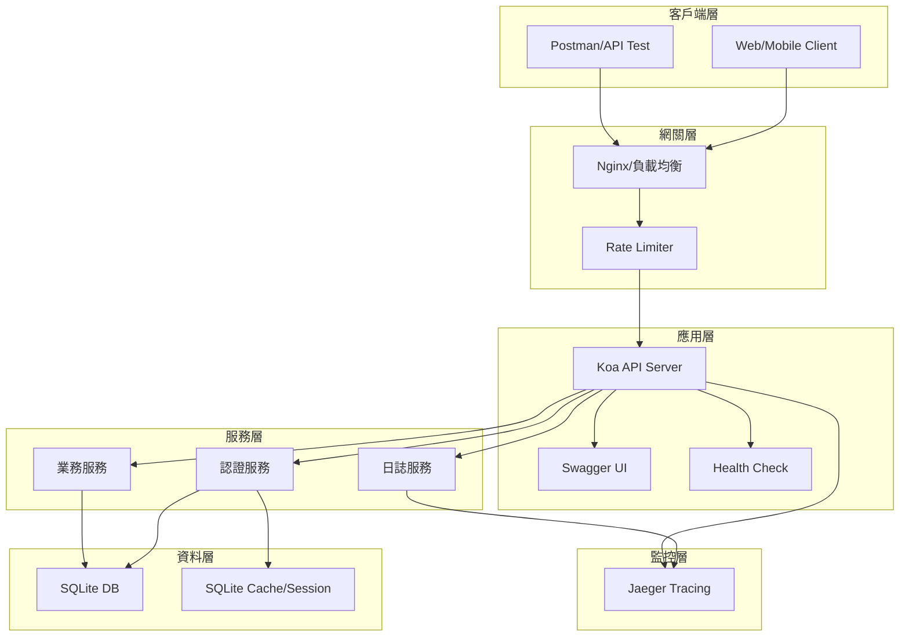

### 分層架構設計

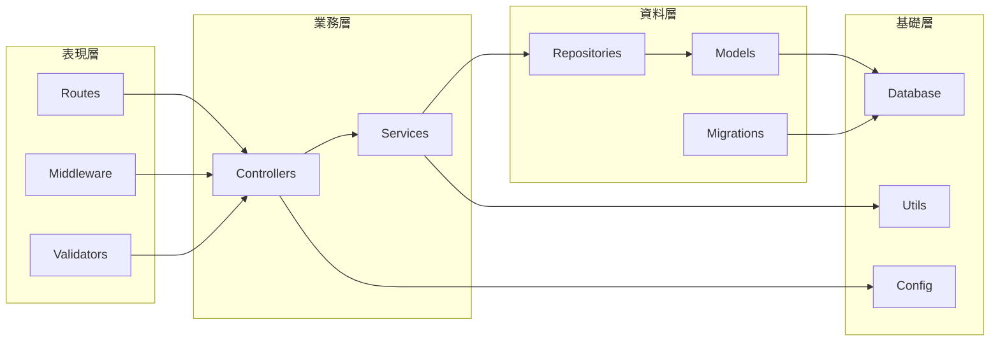

## 技術棧

### 核心技術選型

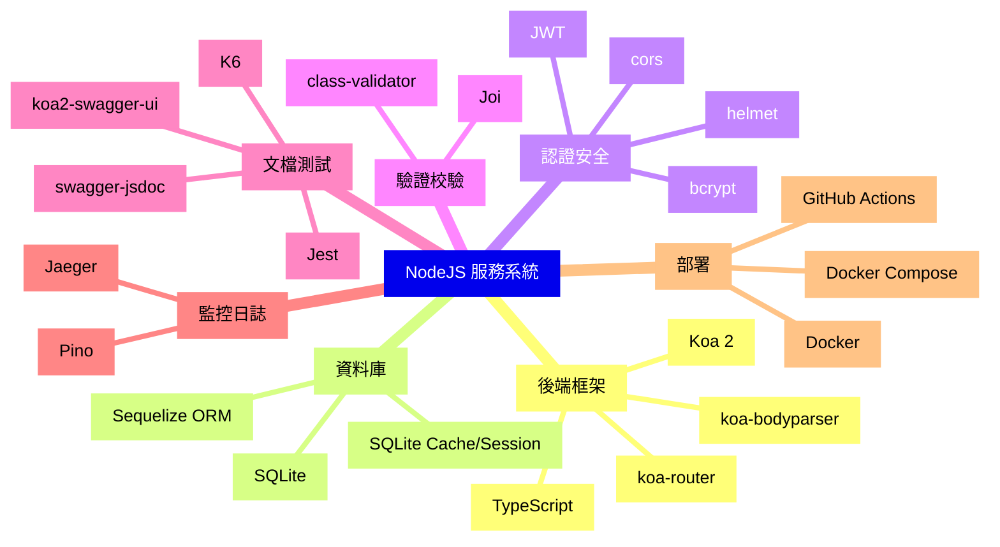

### 技術棧詳細說明

| 類別     | 技術            | 版本  | 用途                |
| -------- | --------------- | ----- | ------------------- |
| 執行環境 | Node.js         | 18+   | JavaScript 執行環境 |
| 語言     | TypeScript      | 5.0+  | 類型安全開發        |
| 框架     | Koa             | 2.14+ | Web 應用框架        |
| 資料庫   | SQLite          | 3.40+ | 開發環境資料庫      |
| ORM      | Sequelize       | 6.35+ | 資料庫操作          |
| 快取     | SQLite          | 3.40+ | Session 與快取      |
| 認證     | jsonwebtoken    | 9.0+  | JWT 生成與驗證      |
| 加密     | bcrypt          | 5.1+  | 密碼雜湊            |
| 驗證     | Joi             | 17.9+ | 請求資料驗證        |
| 文檔     | swagger-jsdoc   | 6.2+  | API 文檔生成        |
| UI       | koa2-swagger-ui | 5.0+  | Swagger UI          |
| 測試     | Jest            | 29.5+ | 單元/整合測試       |
| 壓測     | K6              | 0.45+ | 效能測試            |
| 日誌     | Pino            | 8.14+ | 結構化日誌          |
| 追蹤     | Jaeger          | 1.45+ | 分散式追蹤          |
| 容器     | Docker          | 24.0+ | 容器化部署          |

## 資料庫設計

### ER 關係圖

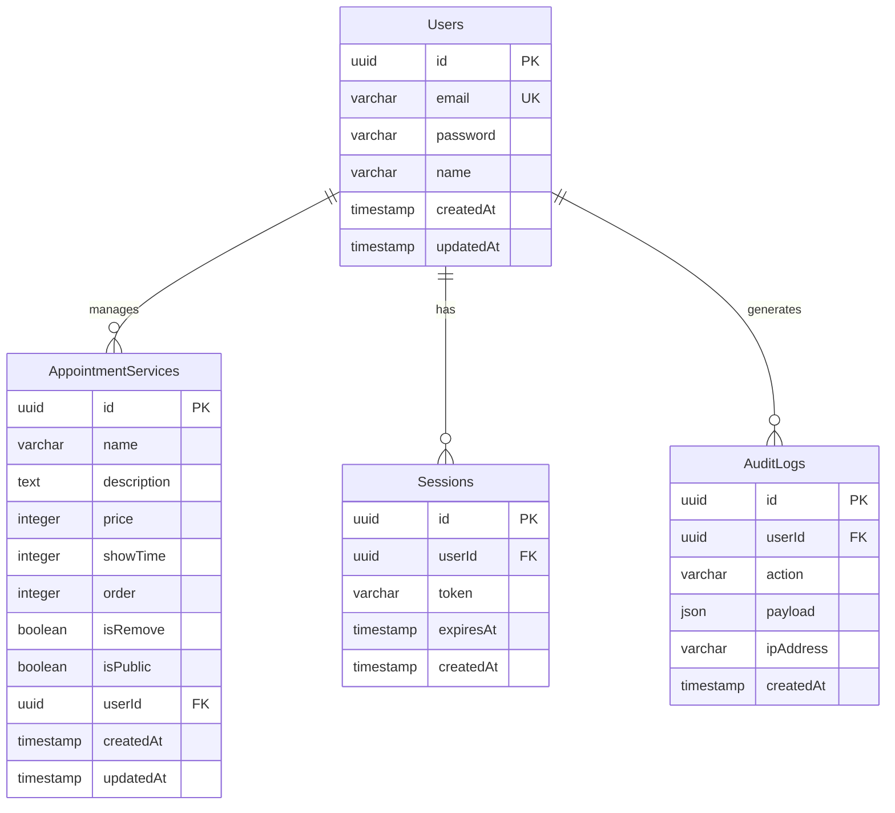

### SQLite 實作方案

```typescript
// database/config.ts
export const sqliteConfig = {
  dialect: 'sqlite',
  storage: process.env.DB_PATH || './database.sqlite',
  logging: process.env.NODE_ENV === 'development' ? console.log : false,
  pool: {
    max: 5,
    min: 0,
    acquire: 30000,
    idle: 10000
  }
};

// SQLite 配置
export const databaseConfig = {
  development: sqliteConfig,
  test: {
    ...sqliteConfig,
    storage: ':memory:'
  },
  production: {
    ...sqliteConfig,
    storage: process.env.DB_PATH || './database.prod.sqlite',
    logging: false
  }
};

// SQLite Cache 配置
export const cacheConfig = {
  dialect: 'sqlite',
  storage: process.env.CACHE_DB_PATH || './cache.sqlite',
  logging: false
};
```

### Migration 策略

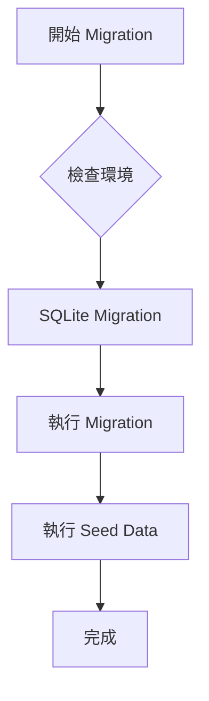

## API 設計

### RESTful API 結構

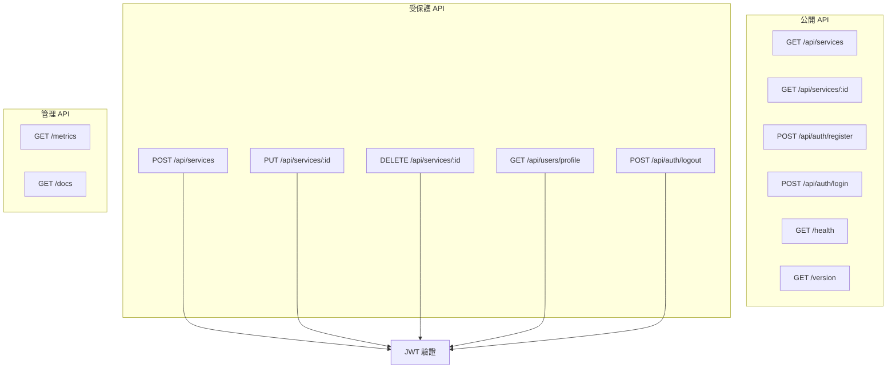

### API 端點詳細說明

| 方法         | 路徑               | 描述            | 認證 | 請求體                                 | 回應                          |
| ------------ | ------------------ | --------------- | ---- | -------------------------------------- | ----------------------------- |
| **認證相關** |
| POST         | /api/auth/register | 用戶註冊        | 否   | `{email, password, name}`              | `{data: {user, token}}`       |
| POST         | /api/auth/login    | 用戶登入        | 否   | `{email, password}`                    | `{data: {user, token}}`       |
| POST         | /api/auth/logout   | 用戶登出        | 是   | -                                      | `{data: {message}}`           |
| POST         | /api/auth/refresh  | 刷新 Token      | 是   | `{refreshToken}`                       | `{data: {token}}`             |
| **服務管理** |
| GET          | /api/services      | 查詢服務列表    | 否   | -                                      | `{data: services[]}`          |
| GET          | /api/services/:id  | 查詢單一服務    | 否   | -                                      | `{data: service}`             |
| POST         | /api/services      | 新增服務        | 是   | `{name, description, price, showTime}` | `{data: service}`             |
| PUT          | /api/services/:id  | 更新服務        | 是   | `{name, description, price, showTime}` | `{data: service}`             |
| DELETE       | /api/services/:id  | 刪除服務        | 是   | -                                      | `{data: {message}}`           |
| **系統相關** |
| GET          | /health            | 健康檢查        | 否   | -                                      | `{status, uptime, timestamp}` |
| GET          | /version           | 版本資訊        | 否   | -                                      | `{version, build, env}`       |
| GET          | /metrics           | 健康指標        | 否   | -                                      | JSON 格式                      |
| GET          | /docs              | Swagger 文檔    | 否   | -                                      | HTML                          |

## 認證與授權

### JWT 認證流程

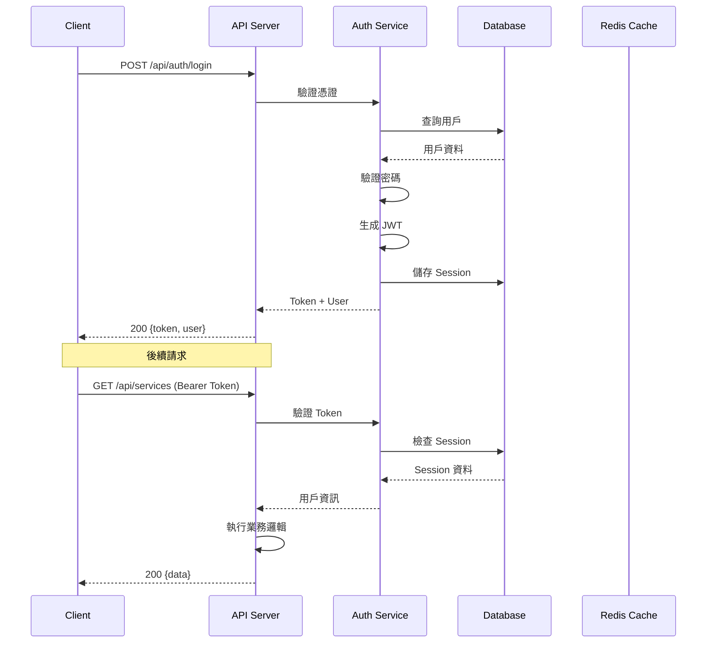

### 權限中介層設計

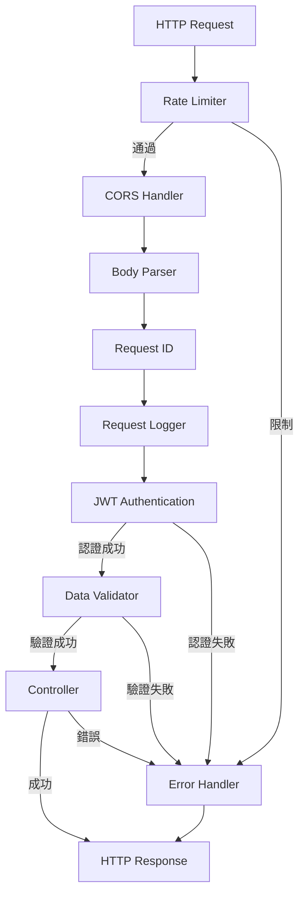

## 增強功能

### 1. K6 壓力測試配置

```javascript
// tests/k6/stress-test.js
import http from 'k6/http';
import { check, sleep } from 'k6';
import { Rate } from 'k6/metrics';

const errorRate = new Rate('errors');

export const options = {
  stages: [
    { duration: '2m', target: 100 },  // 漸進到 100 用戶
    { duration: '5m', target: 100 },  // 維持 100 用戶
    { duration: '2m', target: 200 },  // 增加到 200 用戶
    { duration: '5m', target: 200 },  // 維持 200 用戶
    { duration: '2m', target: 300 },  // 增加到 300 用戶
    { duration: '5m', target: 300 },  // 維持 300 用戶
    { duration: '10m', target: 0 },   // 漸進到 0
  ],
  thresholds: {
    'http_req_duration': ['p(95)<500'], // 95% 請求在 500ms 內
    'errors': ['rate<0.01'],             // 錯誤率 < 1%
  },
};

export default function () {
  // 測試場景實作
  const BASE_URL = 'http://localhost:3000';

  // 1. 健康檢查
  const healthCheck = http.get(`${BASE_URL}/health`);
  check(healthCheck, {
    'health check status is 200': (r) => r.status === 200,
  });

  // 2. 登入測試
  const loginRes = http.post(
    `${BASE_URL}/api/auth/login`,
    JSON.stringify({
      email: 'test@example.com',
      password: 'password123'
    }),
    { headers: { 'Content-Type': 'application/json' } }
  );

  const success = check(loginRes, {
    'login successful': (r) => r.status === 200,
    'has token': (r) => JSON.parse(r.body).data.token !== undefined,
  });

  errorRate.add(!success);

  if (success) {
    const token = JSON.parse(loginRes.body).data.token;

    // 3. 查詢服務列表
    const servicesRes = http.get(
      `${BASE_URL}/api/services`,
      { headers: { 'Authorization': `Bearer ${token}` } }
    );

    check(servicesRes, {
      'services fetched': (r) => r.status === 200,
    });
  }

  sleep(1);
}
```

### 壓測場景圖

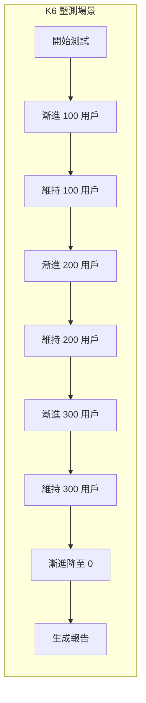

### 2. Swagger 文檔整合

```typescript
// swagger.config.ts
import swaggerJsdoc from 'swagger-jsdoc';
import { koaSwagger } from 'koa2-swagger-ui';

const swaggerOptions = {
  definition: {
    openapi: '3.0.0',
    info: {
      title: '服務預約系統 API',
      version: '1.0.0',
      description: '完整的服務預約管理系統 API 文檔',
      contact: {
        name: 'API Support',
        email: 'api@example.com'
      },
      license: {
        name: 'MIT',
        url: 'https://opensource.org/licenses/MIT'
      }
    },
    servers: [
      {
        url: 'http://localhost:3000',
        description: '開發環境'
      },
      {
        url: 'https://api.example.com',
        description: '生產環境'
      }
    ],
    components: {
      securitySchemes: {
        bearerAuth: {
          type: 'http',
          scheme: 'bearer',
          bearerFormat: 'JWT'
        }
      },
      schemas: {
        Error: {
          type: 'object',
          properties: {
            type: { type: 'string' },
            title: { type: 'string' },
            status: { type: 'number' },
            detail: { type: 'string' },
            instance: { type: 'string' }
          }
        },
        Service: {
          type: 'object',
          properties: {
            id: { type: 'string', format: 'uuid' },
            name: { type: 'string' },
            description: { type: 'string' },
            price: { type: 'number' },
            showTime: { type: 'number' },
            order: { type: 'number' },
            isPublic: { type: 'boolean' },
            createdAt: { type: 'string', format: 'date-time' },
            updatedAt: { type: 'string', format: 'date-time' }
          }
        }
      }
    }
  },
  apis: ['./src/routes/*.ts', './src/controllers/*.ts']
};

export const swaggerSpec = swaggerJsdoc(swaggerOptions);

export const swaggerUI = koaSwagger({
  routePrefix: '/docs',
  swaggerOptions: {
    spec: swaggerSpec,
    docExpansion: 'none',
    persistAuthorization: true,
    tryItOutEnabled: true
  }
});
```

### 3. 健康檢查與版本資訊

```typescript
// health.controller.ts
export class HealthController {
  async healthCheck(ctx: Context) {
    const healthInfo = {
      status: 'healthy',
      timestamp: new Date().toISOString(),
      uptime: process.uptime(),
      environment: process.env.NODE_ENV,
      services: {
        database: await this.checkDatabase(),
        cache: await this.checkDatabase(), // SQLite Cache
        external: await this.checkExternalServices()
      },
      memory: {
        used: process.memoryUsage().heapUsed / 1024 / 1024,
        total: process.memoryUsage().heapTotal / 1024 / 1024,
        unit: 'MB'
      }
    };

    ctx.body = healthInfo;
  }

  async versionInfo(ctx: Context) {
    ctx.body = {
      version: process.env.APP_VERSION || '1.0.0',
      build: process.env.BUILD_NUMBER || 'dev',
      commit: process.env.GIT_COMMIT || 'unknown',
      environment: process.env.NODE_ENV,
      node: process.version,
      dependencies: {
        koa: '2.14.2',
        sequelize: '6.35.1',
        typescript: '5.2.2'
      }
    };
  }

  private async checkDatabase() {
    try {
      // 檢查 SQLite 連線
      const result = await sequelize.authenticate();
      return 'healthy';
    } catch (error) {
      return 'unhealthy';
    }
  }

  private async checkExternalServices() {
    // 檢查外部服務
    return 'healthy';
  }
}
```

### 4. Docker Compose 部署

```yaml
# docker-compose.yml
version: '3.8'

services:
  app:
    build:
      context: .
      dockerfile: Dockerfile
    container_name: service-booking-api
    ports:
      - "3000:3000"
    environment:
      - NODE_ENV=production
      - DB_PATH=/data/database.sqlite
      - CACHE_DB_PATH=/data/cache.sqlite
      - JAEGER_AGENT_HOST=jaeger
    volumes:
      - sqlite-data:/data
    depends_on:
      - jaeger
    networks:
      - app-network
    healthcheck:
      test: ["CMD", "curl", "-f", "http://localhost:3000/health"]
      interval: 30s
      timeout: 10s
      retries: 3
      start_period: 40s

  jaeger:
    image: jaegertracing/all-in-one:latest
    container_name: jaeger
    environment:
      - COLLECTOR_ZIPKIN_HOST_PORT=:9411
    ports:
      - "16686:16686"
      - "14268:14268"
    networks:
      - app-network

networks:
  app-network:
    driver: bridge

volumes:
  sqlite-data:
```

### Docker 架構圖

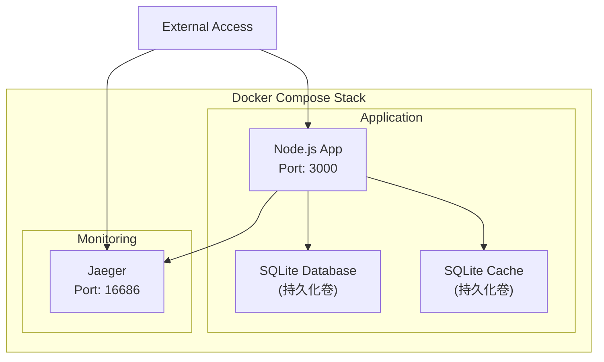

### 5. RFC7807 錯誤處理

```typescript
// error-handler.ts
import { Context } from 'koa';

export interface RFC7807Error {
  type: string;
  title: string;
  status: number;
  detail?: string;
  instance?: string;
  [key: string]: any;
}

export class ErrorHandler {
  static formatError(error: any, ctx: Context): RFC7807Error {
    const timestamp = new Date().toISOString();
    const requestId = ctx.get('x-request-id');

    // 基礎錯誤結構
    const errorResponse: RFC7807Error = {
      type: 'about:blank',
      title: 'Internal Server Error',
      status: 500,
      instance: ctx.path,
      timestamp,
      requestId
    };

    // 根據錯誤類型調整
    if (error.name === 'ValidationError') {
      errorResponse.type = '/errors/validation';
      errorResponse.title = 'Validation Error';
      errorResponse.status = 400;
      errorResponse.detail = error.message;
      errorResponse.errors = error.errors;
    } else if (error.name === 'UnauthorizedError') {
      errorResponse.type = '/errors/unauthorized';
      errorResponse.title = 'Unauthorized';
      errorResponse.status = 401;
      errorResponse.detail = 'Authentication required';
    } else if (error.name === 'ForbiddenError') {
      errorResponse.type = '/errors/forbidden';
      errorResponse.title = 'Forbidden';
      errorResponse.status = 403;
      errorResponse.detail = 'Insufficient permissions';
    } else if (error.name === 'NotFoundError') {
      errorResponse.type = '/errors/not-found';
      errorResponse.title = 'Not Found';
      errorResponse.status = 404;
      errorResponse.detail = error.message || 'Resource not found';
    } else if (error.status) {
      errorResponse.status = error.status;
      errorResponse.title = error.message;
      errorResponse.detail = error.detail;
    }

    return errorResponse;
  }

  static middleware() {
    return async (ctx: Context, next: Function) => {
      try {
        await next();
      } catch (error: any) {
        const errorResponse = ErrorHandler.formatError(error, ctx);
        ctx.status = errorResponse.status;
        ctx.body = errorResponse;

        // 記錄錯誤
        ctx.app.emit('error', error, ctx);
      }
    };
  }
}
```

### 錯誤處理流程圖

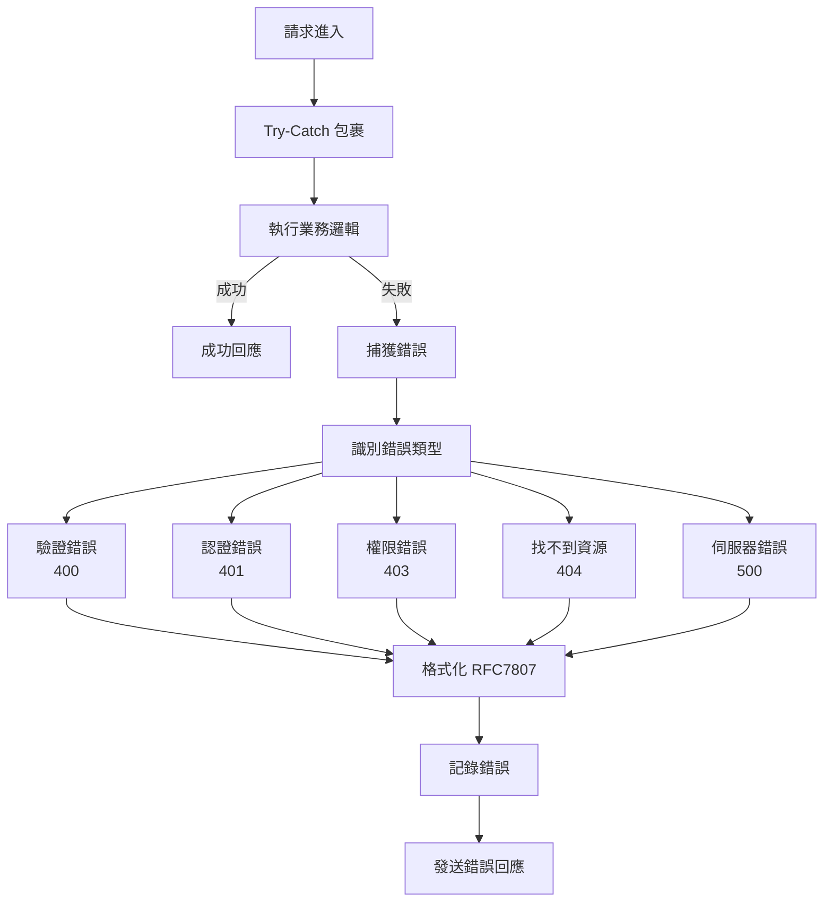

### 6. Pino 日誌與 Request ID

```typescript
// logger.ts
import pino from 'pino';
import { v4 as uuidv4 } from 'uuid';
import { Context } from 'koa';

// Pino 配置
export const logger = pino({
  level: process.env.LOG_LEVEL || 'info',
  transport: {
    targets: [
      {
        target: 'pino-pretty',
        options: {
          colorize: true,
          translateTime: 'SYS:standard',
          ignore: 'pid,hostname'
        }
      },
      {
        target: 'pino/file',
        options: {
          destination: './logs/app.log',
          mkdir: true
        }
      }
    ]
  },
  serializers: {
    req: (req) => ({
      id: req.id,
      method: req.method,
      url: req.url,
      headers: req.headers,
      remoteAddress: req.socket?.remoteAddress
    }),
    res: (res) => ({
      statusCode: res.statusCode,
      headers: res.headers
    })
  }
});

// Request ID 中介層
export const requestIdMiddleware = () => {
  return async (ctx: Context, next: Function) => {
    const requestId = ctx.get('x-request-id') || uuidv4();
    ctx.set('x-request-id', requestId);
    ctx.state.requestId = requestId;

    // 建立子日誌器
    ctx.logger = logger.child({ requestId });

    // 記錄請求
    ctx.logger.info({
      msg: 'Request received',
      method: ctx.method,
      path: ctx.path,
      query: ctx.query,
      ip: ctx.ip
    });

    const start = Date.now();

    try {
      await next();

      // 記錄回應
      const duration = Date.now() - start;
      ctx.logger.info({
        msg: 'Request completed',
        status: ctx.status,
        duration
      });
    } catch (error) {
      const duration = Date.now() - start;
      ctx.logger.error({
        msg: 'Request failed',
        error: error.message,
        stack: error.stack,
        duration
      });
      throw error;
    }
  };
};
```

### 7. Jaeger 分散式追蹤

```typescript
// tracing.ts
import { initTracer, TracingConfig, TracingOptions } from 'jaeger-client';
import { Context } from 'koa';

const config: TracingConfig = {
  serviceName: 'service-booking-api',
  reporter: {
    agentHost: process.env.JAEGER_AGENT_HOST || 'localhost',
    agentPort: Number(process.env.JAEGER_AGENT_PORT) || 6832,
    logSpans: true
  },
  sampler: {
    type: 'const',
    param: 1
  }
};

const options: TracingOptions = {
  logger: {
    info: (msg) => console.log('JAEGER INFO:', msg),
    error: (msg) => console.error('JAEGER ERROR:', msg)
  }
};

export const tracer = initTracer(config, options);

// Tracing 中介層
export const tracingMiddleware = () => {
  return async (ctx: Context, next: Function) => {
    const span = tracer.startSpan(`${ctx.method} ${ctx.path}`);

    // 設定標籤
    span.setTag('http.method', ctx.method);
    span.setTag('http.url', ctx.url);
    span.setTag('http.remote_addr', ctx.ip);
    span.setTag('request.id', ctx.state.requestId);

    ctx.state.span = span;

    try {
      await next();
      span.setTag('http.status_code', ctx.status);
    } catch (error) {
      span.setTag('error', true);
      span.setTag('error.message', error.message);
      throw error;
    } finally {
      span.finish();
    }
  };
};

// 服務層追蹤範例
export function traceAsync(operationName: string) {
  return function (
    target: any,
    propertyKey: string,
    descriptor: PropertyDescriptor
  ) {
    const originalMethod = descriptor.value;

    descriptor.value = async function (...args: any[]) {
      const parentSpan = args[0]?.state?.span;
      const span = tracer.startSpan(operationName, {
        childOf: parentSpan
      });

      try {
        const result = await originalMethod.apply(this, args);
        return result;
      } catch (error) {
        span.setTag('error', true);
        span.setTag('error.message', error.message);
        throw error;
      } finally {
        span.finish();
      }
    };

    return descriptor;
  };
}
```

### 追蹤架構圖

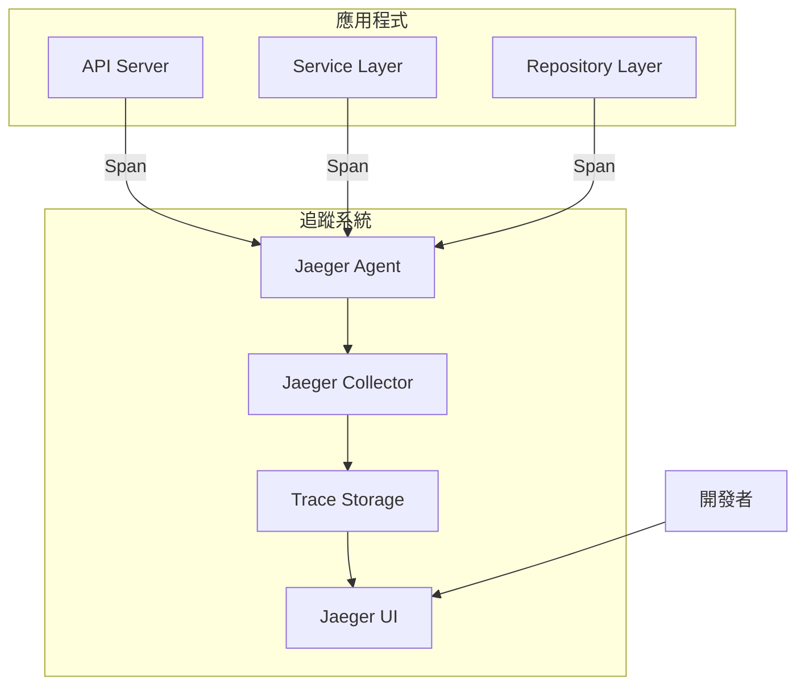

## 測試策略

### 測試金字塔

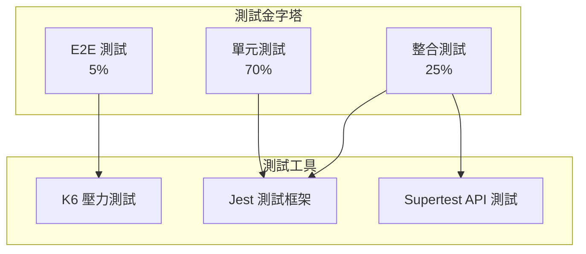

### 測試覆蓋率要求

| 測試類型 | 覆蓋率目標 | 測試重點                      |
| -------- | ---------- | ----------------------------- |
| 單元測試 | > 80%      | 業務邏輯、工具函數、驗證器    |
| 整合測試 | > 60%      | API 端點、資料庫操作、中介層  |
| E2E 測試 | 核心流程   | 註冊登入、CRUD 操作、錯誤處理 |

### K6 壓測場景

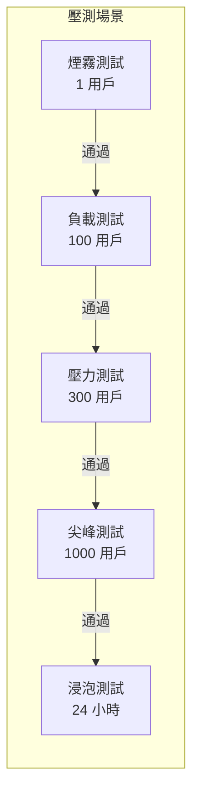

### 測試腳本範例

```typescript
// tests/services/auth.service.test.ts
describe('AuthService', () => {
  let authService: AuthService;
  let userRepository: jest.Mocked<UserRepository>;

  beforeEach(() => {
    userRepository = createMockRepository<UserRepository>();
    authService = new AuthService(userRepository);
  });

  describe('register', () => {
    it('should create new user with hashed password', async () => {
      const userData = {
        email: 'test@example.com',
        password: 'password123',
        name: 'Test User'
      };

      userRepository.findByEmail.mockResolvedValue(null);
      userRepository.create.mockResolvedValue({
        id: 'uuid',
        ...userData,
        password: 'hashed_password'
      });

      const result = await authService.register(userData);

      expect(result).toHaveProperty('token');
      expect(result.user).not.toHaveProperty('password');
      expect(userRepository.create).toHaveBeenCalledWith(
        expect.objectContaining({
          email: userData.email,
          name: userData.name,
          password: expect.not.stringMatching(userData.password)
        })
      );
    });

    it('should throw error if email already exists', async () => {
      userRepository.findByEmail.mockResolvedValue({ id: 'existing' });

      await expect(
        authService.register({
          email: 'existing@example.com',
          password: 'password',
          name: 'User'
        })
      ).rejects.toThrow('Email already registered');
    });
  });
});
```


## 監控與追蹤

### 監控架構

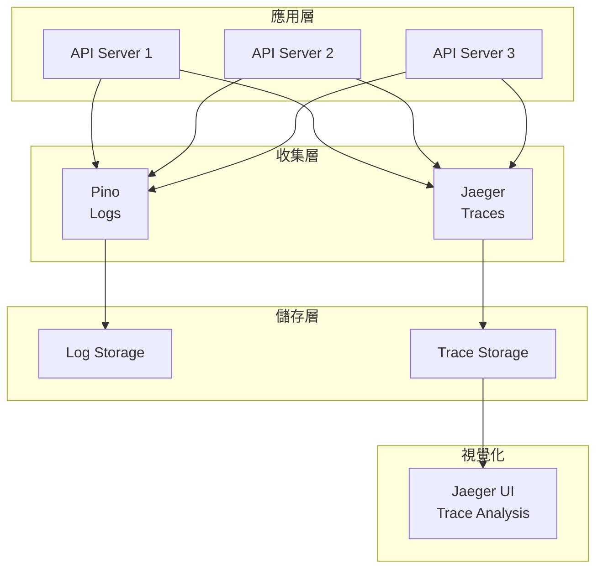

### 健康指標配置

```typescript
// metrics.ts
import { Context } from 'koa';

// 應用程式指標
interface AppMetrics {
  requestCount: number;
  errorCount: number;
  activeConnections: number;
  avgResponseTime: number;
  databasePoolSize: number;
}

class MetricsCollector {
  private metrics: AppMetrics = {
    requestCount: 0,
    errorCount: 0,
    activeConnections: 0,
    avgResponseTime: 0,
    databasePoolSize: 0
  };

  private responseTimes: number[] = [];
  private readonly maxSamples = 1000;

  incrementRequest() {
    this.metrics.requestCount++;
  }

  incrementError() {
    this.metrics.errorCount++;
  }

  setActiveConnections(count: number) {
    this.metrics.activeConnections = count;
  }

  addResponseTime(time: number) {
    this.responseTimes.push(time);
    if (this.responseTimes.length > this.maxSamples) {
      this.responseTimes.shift();
    }
    this.calculateAvgResponseTime();
  }

  private calculateAvgResponseTime() {
    if (this.responseTimes.length === 0) {
      this.metrics.avgResponseTime = 0;
    } else {
      const sum = this.responseTimes.reduce((a, b) => a + b, 0);
      this.metrics.avgResponseTime = sum / this.responseTimes.length;
    }
  }

  getMetrics(): AppMetrics {
    return { ...this.metrics };
  }
}

export const metricsCollector = new MetricsCollector();

// Metrics 中介層
export const metricsMiddleware = () => {
  return async (ctx: Context, next: Function) => {
    const start = Date.now();
    metricsCollector.setActiveConnections(
      metricsCollector.getMetrics().activeConnections + 1
    );

    try {
      await next();
      metricsCollector.incrementRequest();
    } catch (error) {
      metricsCollector.incrementError();
      throw error;
    } finally {
      const duration = Date.now() - start;
      metricsCollector.addResponseTime(duration);
      metricsCollector.setActiveConnections(
        metricsCollector.getMetrics().activeConnections - 1
      );
    }
  };
};

// Metrics 端點
export const metricsEndpoint = async (ctx: Context) => {
  ctx.body = {
    timestamp: new Date().toISOString(),
    metrics: metricsCollector.getMetrics(),
    uptime: process.uptime(),
    memory: {
      used: process.memoryUsage().heapUsed / 1024 / 1024,
      total: process.memoryUsage().heapTotal / 1024 / 1024,
      unit: 'MB'
    }
  };
};
```


## 專案結構

```
service-booking-api/
├── src/
│   ├── config/           # 設定檔
│   │   ├── database.ts
│   │   ├── redis.ts
│   │   ├── swagger.ts
│   │   └── app.ts
│   ├── controllers/      # 控制器
│   │   ├── auth.controller.ts
│   │   ├── service.controller.ts
│   │   └── health.controller.ts
│   ├── services/         # 業務邏輯
│   │   ├── auth.service.ts
│   │   └── appointment.service.ts
│   ├── repositories/     # 資料存取
│   │   ├── user.repository.ts
│   │   └── service.repository.ts
│   ├── models/           # 資料模型
│   │   ├── user.model.ts
│   │   └── service.model.ts
│   ├── middlewares/      # 中介層
│   │   ├── auth.middleware.ts
│   │   ├── error.middleware.ts
│   │   ├── logger.middleware.ts
│   │   ├── tracing.middleware.ts
│   │   └── validation.middleware.ts
│   ├── routes/           # 路由
│   │   ├── auth.routes.ts
│   │   ├── service.routes.ts
│   │   └── index.ts
│   ├── utils/            # 工具函數
│   │   ├── logger.ts
│   │   ├── tracer.ts
│   │   └── validator.ts
│   ├── migrations/       # 資料庫遷移
│   ├── seeders/          # 種子資料
│   └── app.ts           # 應用程式入口
├── tests/               # 測試檔案
│   ├── unit/
│   ├── integration/
│   └── k6/
├── docker/              # Docker 相關
│   ├── Dockerfile
│   └── docker-compose.yml
├── .github/             # GitHub Actions
│   └── workflows/
├── docs/                # 文檔
├── logs/                # 日誌檔案
├── .env.example        # 環境變數範例
├── .eslintrc.js        # ESLint 設定
├── .prettierrc         # Prettier 設定
├── jest.config.js      # Jest 設定
├── tsconfig.json       # TypeScript 設定
├── package.json        # 專案設定
└── README.md          # 專案說明
```

## 快速開始指南

### 1. 環境準備

```bash
# 克隆專案
git clone https://github.com/yourusername/service-booking-api.git
cd service-booking-api

# 安裝依賴
npm install

# 設定環境變數
cp .env.example .env
```

### 2. 資料庫設定

```bash
# 執行 migration
npm run db:migrate

# 執行種子資料
npm run db:seed
```

### 3. 啟動服務

```bash
# 開發模式
npm run dev

# 生產模式
npm run build
npm start

# Docker 啟動
docker-compose up
```

### 4. 訪問服務

- API 服務: http://localhost:3000
- Swagger 文檔: http://localhost:3000/docs
- 健康檢查: http://localhost:3000/health
- Prometheus 指標: http://localhost:3000/metrics
- Jaeger UI: http://localhost:16686
- Grafana: http://localhost:3001

### 5. 執行測試

```bash
# 單元測試
npm run test:unit

# 整合測試
npm run test:integration

# 覆蓋率報告
npm run test:coverage

# K6 壓力測試
npm run test:k6
```

## 總結

本專案實現了一個完整的服務預約管理系統，涵蓋：

✅ **核心功能**
- JWT 認證系統
- 服務 CRUD 操作
- 權限控制

✅ **增強功能**
- K6 壓力測試
- Swagger API 文檔
- Docker Compose 部署
- RFC7807 錯誤處理
- Pino 結構化日誌
- Jaeger 分散式追蹤
- Prometheus 監控

✅ **最佳實踐**
- 分層架構設計
- TypeScript 類型安全
- 完整測試覆蓋
- CI/CD 自動化
- 全面監控方案

本系統可作為生產環境的基礎架構，具有良好的擴展性和維護性。

## CI/CD 與部署

### CI/CD 流程

```mermaid
flowchart LR
    subgraph "開發"
        Dev["本地開發"]
        Test["本地測試"]
        Commit["Git Commit"]
    end

    subgraph "CI Pipeline"
        GH["GitHub Actions"]
        Lint["ESLint/Prettier"]
        UnitTest["單元測試"]
        IntTest["整合測試"]
        Build["Docker Build"]
        Scan["安全掃描"]
    end

    subgraph "CD Pipeline"
        Push["Push Image"]
        Deploy["部署"]
        HealthCheck["健康檢查"]
        Rollback["回滾機制"]
    end

    Dev --> Test
    Test --> Commit
    Commit --> GH
    GH --> Lint
    Lint --> UnitTest
    UnitTest --> IntTest
    IntTest --> Build
    Build --> Scan
    Scan --> Push
    Push --> Deploy
    Deploy --> HealthCheck
    HealthCheck -->|失敗| Rollback
```

### GitHub Actions 配置

```yaml
# .github/workflows/ci-cd.yml
name: CI/CD Pipeline

on:
  push:
    branches: [main, develop]
  pull_request:
    branches: [main]

jobs:
  test:
    runs-on: ubuntu-latest

    steps:
      - uses: actions/checkout@v3

      - name: Setup Node.js
        uses: actions/setup-node@v3
        with:
          node-version: '18'
          cache: 'npm'

      - name: Install dependencies
        run: npm ci

      - name: Run linter
        run: npm run lint

      - name: Run tests
        run: npm test -- --coverage
        env:
          NODE_ENV: test
          DB_PATH: ':memory:'

      - name: Upload coverage
        uses: codecov/codecov-action@v3
        with:
          file: ./coverage/coverage-final.json

  build:
    needs: test
    runs-on: ubuntu-latest
    if: github.ref == 'refs/heads/main'

    steps:
      - uses: actions/checkout@v3

      - name: Set up Docker Buildx
        uses: docker/setup-buildx-action@v2

      - name: Login to Docker Hub
        uses: docker/login-action@v2
        with:
          username: ${{ secrets.DOCKER_USERNAME }}
          password: ${{ secrets.DOCKER_PASSWORD }}

      - name: Build and push
        uses: docker/build-push-action@v4
        with:
          context: .
          push: true
          tags: |
            ${{ secrets.DOCKER_USERNAME }}/service-booking-api:latest
            ${{ secrets.DOCKER_USERNAME }}/service-booking-api:${{ github.sha }}

  deploy:
    needs: build
    runs-on: ubuntu-latest
    if: github.ref == 'refs/heads/main'

    steps:
      - name: Deploy to production
        run: |
          echo "Deploying to production..."
          # 實際部署指令
```

## 進階未來發展

### 監控與可視化增強

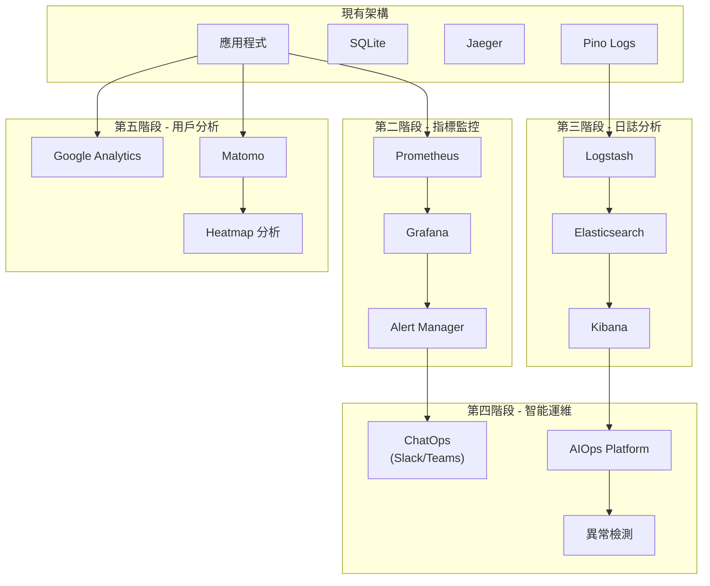

### 發展路線圖

#### 第一階段：基礎建設（當前）
- ✅ SQLite 資料庫
- ✅ Jaeger 分散式追蹤
- ✅ Pino 結構化日誌
- ✅ Docker 容器化

#### 第二階段：指標監控
- Prometheus 時序資料庫
- Grafana 視覺化儀表板
- Alert Manager 告警管理
- 自定義業務指標

#### 第三階段：日誌分析
- Elasticsearch 日誌儲存
- Kibana 日誌視覺化
- Logstash 日誌收集
- 日誌聚合與分析

#### 第四階段：智能運維
- ChatOps 整合（Slack/Microsoft Teams）
- AIOps 平台導入
- 機器學習異常檢測
- 預測性維護

#### 第五階段：用戶分析
- Google Analytics 整合
- Matomo 開源分析平台
- 用戶行為追蹤
- Heatmap 熱圖分析

### 技術選型建議

| 功能領域   | 開源方案              | 企業方案                |
| ---------- | --------------------- | ----------------------- |
| 指標監控   | Prometheus + Grafana  | DataDog / New Relic     |
| 日誌管理   | ELK Stack             | Splunk / Sumo Logic     |
| APM        | Jaeger / Zipkin       | AppDynamics / Dynatrace |
| 告警管理   | Alert Manager         | PagerDuty / Opsgenie    |
| ChatOps    | Hubot                 | Slack / Teams 原生整合   |
| AIOps      | Seldon Core           | Moogsoft / BigPanda     |
| 用戶分析   | Matomo / Plausible    | Google Analytics 360    |

### 實施優先級

1. **高優先級**
   - Prometheus + Grafana（系統監控）
   - Alert Manager（告警系統）
   - 基礎 ChatOps（Slack 通知）

2. **中優先級**
   - ELK Stack（日誌分析）
   - Google Analytics（用戶追蹤）
   - 進階告警規則

3. **低優先級**
   - AIOps 平台
   - 機器學習模型
   - 預測性分析

### 預期效益

- **運維效率提升 40%**：透過自動化告警和 ChatOps
- **故障響應時間減少 60%**：透過智能告警和異常檢測
- **用戶體驗改善**：透過性能監控和用戶行為分析
- **成本優化**：透過資源使用分析和預測性擴容

### 投資回報率（ROI）

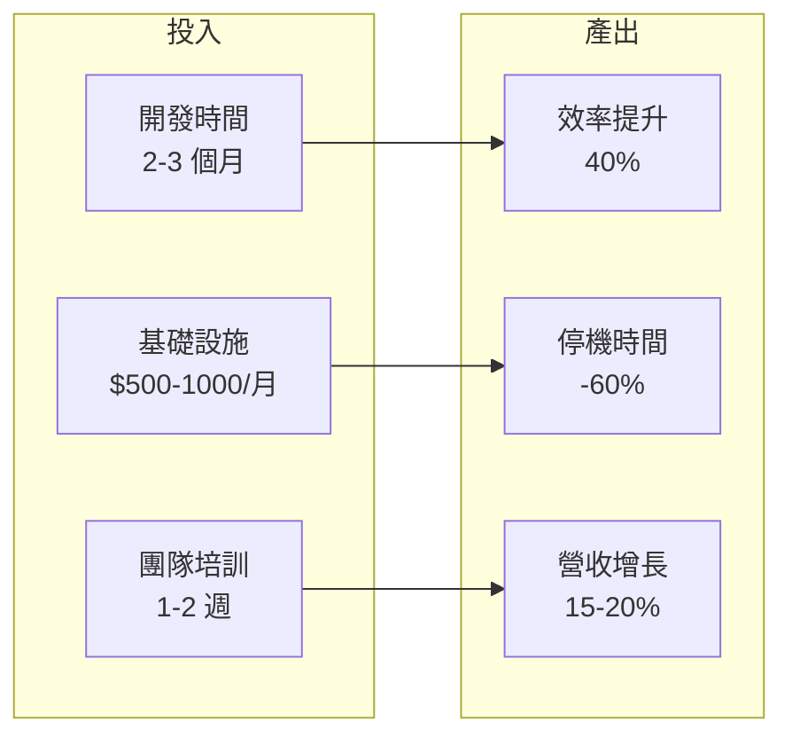

### 進階發展總結

進階監控和分析系統的建設是一個循序漸進的過程。從基礎的 Jaeger 追蹤開始，逐步擴展到完整的可觀測性平台，最終實現智能化運維和數據驅動決策。每個階段的實施都應該基於實際業務需求和投資回報率來決定。
